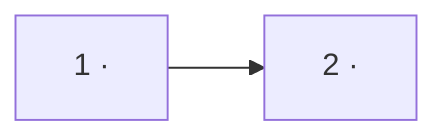

<!-- instruction: the frontmatter above is the WHOLE frontmatter — two keys, verbatim.
Do not add keys of your own (`source:`, `owner:`, `depth:`); the source belongs in each
row's Source column, where it can be checked. -->

# Roadmap — <repo>

> **A decomposition, not a promise.** The overall idea broken into incremental steps: what each
> step is, where it comes from, how big it is — or that nobody has looked at it yet — and in which
> order, and parallel lanes, we walk them. **No dates** (except shipped history), **no scores** —
> order is the prioritization. The *solution* for any step lives in its `docs/features/<slug>/`
> spec, not here.

## Destination

<!-- instruction: ONE sentence for what "we got there" looks like — what is true about the product
once the last step below has shipped. Not a list, not a goal with sub-bullets: one sentence a
reader can hold in their head while walking the rest of the file. Everything else here says how
far along we are; this is the only line that says where along. -->

<one sentence: what the product does for whom once every step below is walked>

## Steps

<!-- instruction: the idea decomposed into vertical, buildable increments. One ROW each.
Source = the section of the idea-brief/PRD/canon that justifies the step (no anchor → no step).
Size ∈ XS | S | M | L | XL | fog. XS–XL per _shared/size-matrix.md; `fog` is not a size but its
absence — the step nobody has formulated yet, so nothing about its shape is known. A `fog` row
points its Step cell at the matching `## Not yet specified` area and gets no XS–XL anywhere.
Status ∈ idea | spec'd | building | shipped — how far the BUILDING got; specify/ship keep it current.
Dependencies are NOT a column here: every edge lives in `## Dependency graph`, which is their one
source of truth. In prose, call a step by its NAME («Import from CSV»), not by its bare id — the
id is for the table and the graph, where something machine-readable has to point. -->

| # | Step | Source | Size | Status |
|---|---|---|:---:|---|
| 1 | <increment — what the user can do after it> | <doc §> | S | idea |
| 2 | <increment> | <doc §> | M | idea |
| 3 | <increment> → see [Not yet specified](#not-yet-specified) | <doc §> | fog | idea |

## Not yet specified

<!-- instruction: what is IN scope but not yet formulated precisely enough to cut. The test is
Pocock's: can you state the question exactly right now — NOT can you answer it. If you can't state
it, it belongs here, as ONE area with what you'd have to learn to sharpen it. Do NOT pre-chop it
into ticket-sized pieces: inventing structure for something nobody has looked at is exactly the
failure this section exists to prevent. An area leaves here by being reconnoitred, and then its
step above trades `fog` for a real size. -->

| Area | What we'd have to learn | Blocks | How it gets sharpened |
|---|---|:---:|---|
| <the fog, named> | <the thing nobody has looked at yet> | 3 | <recon pass / prototype / a conversation with X> |

## Out of scope

<!-- instruction: deliberately outside, each with a one-line reason. Unlike `Not yet specified`,
an entry here NEVER graduates — if something moves out of this list, that is a scope change the
owner makes explicitly, not a step quietly promoting itself. -->

- <thing> — <why it's out>

## Open decisions

<!-- instruction: what is still undecided, one row each, with a TYPE and an OWNER.
BOTH ARE CLOSED ENUMS — a value outside them is a self-check failure, not a judgement call.
Type ∈ research (a lookup — an agent can close it) | prototype (has to be built to be known) |
grilling (needs a live exchange with a human) | task (decided in principle, just not done yet).
Owner ∈ agent | human — the ROLE that can close it, never a person's name. A `grilling` row is
`human` by definition: nothing stands in for the human's side of that exchange, and a question
about what someone wants is grilling, not research.
These die at the end of the session unless they're written down here. -->

| # | Question | Type | Owner | Blocks |
|---|---|:---:|:---:|:---:|
| D1 | <the question, stated precisely> | research | agent | 2 |
| D2 | <the question> | grilling | human | 3 |

## Decisions so far

<!-- instruction: gist plus link — one line of what was decided, then a pointer to where the
decision actually lives (ADR / spec / thread). Never restate the reasoning here; a paragraph of
solution detail copied in becomes a second source of truth and drifts. -->

- <one-line gist of the decision> → [`<where it lives>`](<path>)

## Dependency graph

<!-- instruction: THE source of truth for what blocks what — a mermaid flowchart of the step ids,
every edge labeled with its one-line reason (data model / UI zone / auth precondition / …). The
steps table deliberately carries no `Depends on` column: edges live here and only here, so there is
nothing for them to drift against. An edge you cannot justify in one line does not belong — a
phantom edge serializes work that could have run in parallel. Presented in prose in the terminal,
written here. -->

## Execution path

<!-- instruction: waves DERIVED from the graph — wave N holds only steps whose deps are in earlier
waves. The non-derivable part is Zone: the code area that makes two steps in one wave conflict-safe
(different modules / UI zones), so they can run as parallel lanes (e.g. git worktrees). Zones come
from `docs/architecture-map.md` when it exists; with no map, a zone that is not an existing path is
marked `(new)` and the waves are a first cut to re-cut after `survey`. A `fog` step never enters a
wave — it has no size and no shape yet; its recon pass does. -->

| Wave | Steps | Zone per step (why parallel-safe) | Unlocks |
|:---:|---|---|---|
| 1 | 1 | <module/zone> | 2, 3 |
| 2 | 2 ∥ 4 | 2: <zone> · 4: <zone> (disjoint) | 5 |

## Shipped

<!-- instruction: history — the only place dates are allowed. -->

| Step | Shipped | Link |
|---|---|---|
| <step> | <YYYY-MM-DD> | <PR/changelog> |
