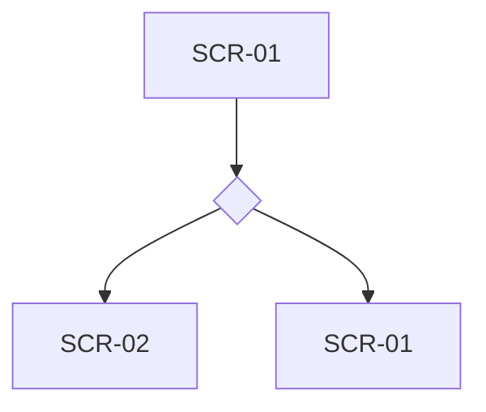

# UX flows — <feature>

> User flows for every UI-touching §4 user story, produced by `ux-flows` (after `clarify`, before
> `design`) and read by `design` (evidence for the target-surface + UI-architecture decisions),
> `sequences` (UI-driven flows align on SCR ids), `screens` (details every inventory row) and
> `plan-tests` (the e2e-through-UI paths). **Always markdown + mermaid `flowchart`**, whatever the
> design tool — this artifact is flow-altitude, not visual design.

## Platform decisions

<!-- instruction: the posture these flows assume — default from docs/design-system.md §Platform
     posture; a deviation is named + justified. Plus per-feature interaction decisions at flow
     altitude (navigation shape, modality — dialog vs page, wizard vs single form). NO visual
     design, no component choices — that's screens. -->

- **Posture:** <mobile-first | desktop-first | responsive-both> — <«per design-system» or the deviation + why>
- <other platform-level decisions, one per line>

## Screen inventory

<!-- instruction: every distinct screen the flows visit — the SCR-NN ids are the downstream
     contract (screens.md details each; sequences may reference them). entry = how the user lands
     there; exit = where they leave to. -->

| ID | Screen | Purpose | Entry | Exit |
|---|---|---|---|---|
| SCR-01 | <name> | <one line> | <from where> | <to where> |

## Flows

<!-- instruction: ONE flow per UI-touching §4 user story — the happy path + the alt/error branches
     its §5 ACs demand. Nodes reference SCR-NN ids from the inventory. Labels may translate per
     artifact_language; mermaid keywords and SCR ids never do. Each flow is followed by its prose
     account (the confirmation channel per diagram-presentation). -->

### Flow: <US-n — name>

<one-paragraph prose account: the happy path + every branch, in plain words>

## AC coverage

<!-- instruction: every UI-touching §5 AC → the flow / node / branch that shows it, or an explicit
     N/A with a one-line reason. The structural self-check counts this table. -->

| AC | Shown by | Notes |
|---|---|---|
| AC-01 | Flow US-1 → <branch/node> | <…> |
