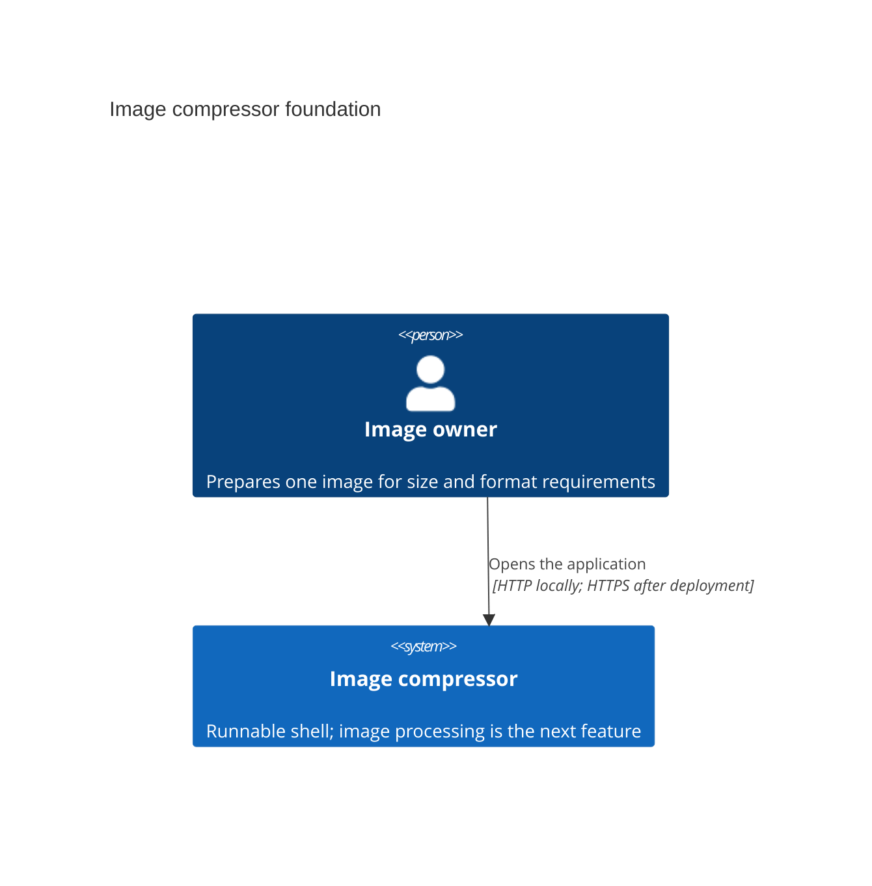
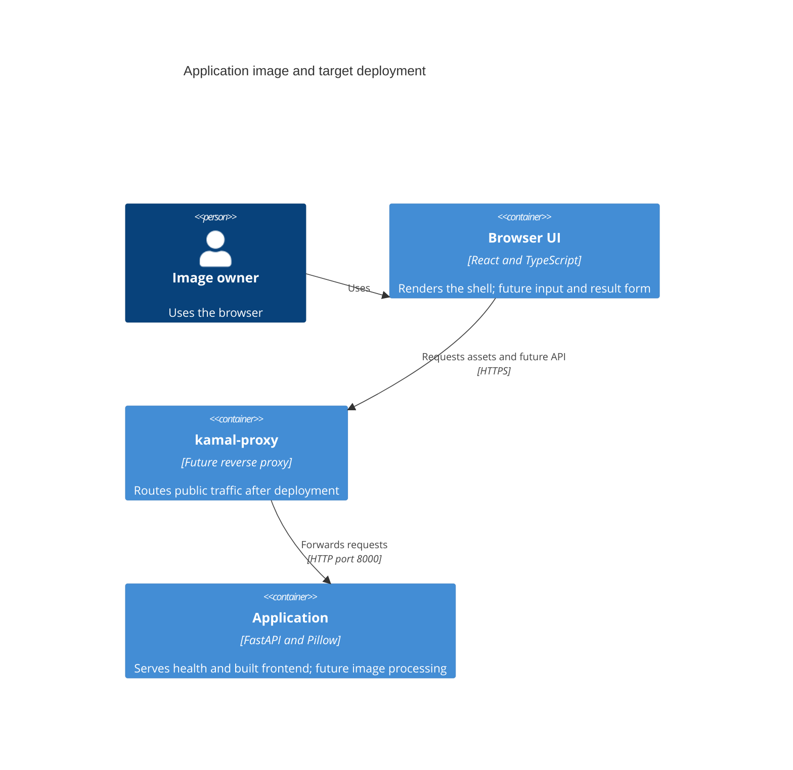

# Architecture map — image-compressor

The foundation is materialized over baseline commit `616dca8`. This map includes the skeleton committed with this update. Build, boot, tests, lint, setup, reload, HMR and local container smoke passed on 2026-09-05. [Scaffold tasks](features/_scaffold/tasks.json) contain command evidence. Hosted GitHub Actions has not run; no remote is configured.

## Stack

- Python 3.14, FastAPI, Uvicorn and Pillow. uv owns the root project and default development dependencies — `pyproject.toml:1` and `uv.lock`.
- React, Vite, TypeScript and Tailwind use npm — `frontend/package.json:1` and `frontend/package-lock.json`. TypeScript stays on 6.0.x to satisfy typescript-eslint peer requirements.
- mise pins Python 3.14.6, Node.js 24.18.1, uv 0.12.9 and Ruby 4.0.5 — `mise.toml:1`. `UV_PYTHON` points to mise's interpreter; uv owns `.venv` — `mise.toml:7`.
- Kamal is declared in `Gemfile:3` and locked to 2.12.0. Ruby and Bundler are deployment tools, outside the application runtime.
- Build, test and lint commands in frontmatter ran successfully. Build the frontend before pytest; the smoke test requires emitted assets — `tests/test_smoke.py:21`.

## C4 — system as it is

The application image exists and runs locally. Image processing is future behavior. The public proxy and deployment below remain the target topology.





One image contains backend code and built frontend assets. The browser UI is a logical client, not a second deployed service. Local checks access the application directly without a proxy — `Dockerfile:17` and `docs/adr/0002-single-service-and-kamal.md:29`.

## Module inventory

| Module | Path | Wired at | Responsibility |
|---|---|---|---|
| Backend | `backend/` | `backend/main.py:5` | Health endpoint and built frontend serving |
| Frontend | `frontend/` | `frontend/src/main.tsx:6` | React shell and baseline styling |
| Development tooling | Repository root | `mise.toml:13` | Sequential setup and concurrent dev servers |
| Container delivery | Repository root | `Dockerfile:17` | One non-root application image |
| Verification | `tests/`, `.github/workflows/` | `tests/test_smoke.py:10`, `.github/workflows/ci.yml:1` | Shared in-process and live-container smoke scenarios |

## Conventions

- **Module wiring:** FastAPI entry point and health handler — `backend/main.py:5`. Future handlers call ordinary functions in `backend/images.py`; create that file when image behavior exists — `docs/adr/0002-single-service-and-kamal.md:13`.
- **HTTP errors:** use Pydantic validation and standard FastAPI errors at the HTTP boundary. Define processing responses in the feature contract — `docs/adr/0002-single-service-and-kamal.md:23`.
- **Frontend serving:** `app.frontend` serves the build with fallback disabled, preserving API 404s — `backend/main.py:13`. Registration is conditional on the build directory so the API boots before a build exists. Restart the backend after the first build.
- **Tests:** pytest and HTTPX check health, built HTML, emitted JS/CSS and unknown API paths with JSON and HTML Accept headers — `tests/test_smoke.py:10`. `SMOKE_BASE_URL` runs the same scenarios against a live container. Ruff, TypeScript and ESLint provide static checks.
- **UI communication:** future browser requests use relative `/api` fetch calls. Vite proxies `/api` to the backend — `frontend/vite.config.ts:8`. Use React local state; no global store, server-cache library or client router.

## Datastores

No persistent datastore, image IDs, object store, queue or migration tool exists. `migration_tool: ""` means N/A, not a missing command — `docs/adr/0003-transient-image-processing.md:16`.

Future uploads use request-scoped FastAPI `UploadFile` storage. Future encoded results remain in memory until the response completes. Specify resource limits and cleanup for completion, errors and interruption before implementing processing — `docs/adr/0003-transient-image-processing.md:13`.

## Frontend / UI foundation

- **Closest precedent:** `frontend/src/App.tsx:1` is a shell, not the compression form. Add the agreed single form with independently optional limits in the feature.
- **Components:** native accessible controls and React local state. Extract shared components only for actual reuse; no third-party component kit — `docs/adr/0002-single-service-and-kamal.md:25`.
- **Styling:** Tailwind Vite plugin — `frontend/vite.config.ts:6`. Typography, warm background, dark text and green accent live in one token entry point — `frontend/src/index.css:3`. The feature must retain deliberate spacing and a clear primary action, with the form as the focus — `docs/idea-brief.md:47`.
- **Motion:** the shell has CSS entry motion gated by reduced-motion preference — `frontend/src/index.css:21`. Future controls, selection, processing and results need immediate interaction, stable layout, truthful progress, keyboard access, visible focus, readable contrast and clear errors — `docs/idea-brief.md:49` and `docs/adr/0002-single-service-and-kamal.md:25`.
- **Acceptance:** the shell was rendered in Chrome and HMR verified. Review the complete image-to-result flow on mobile and desktop when the feature exists; scaffold does not satisfy that future acceptance gate.

## Root development commands

The owner runs `mise run setup` after installing the pinned tools. Setup sequentially runs `uv sync --locked`, `npm --prefix frontend ci --include=dev` and `bundle install` — `mise.toml:13`. Both successful runs in a disposable repository copy preserved all lockfile hashes. An invalid uv.lock stopped execution before npm or Bundler.

`mise run dev` starts both dependency tasks with two task slots — `mise.toml:10` and `mise.toml:20`:

```sh
uv run uvicorn backend.main:app --reload --reload-dir backend --port 8000
npm --prefix frontend run dev -- --port 5173 --strictPort
```

Open <http://localhost:5173>. Vite proxies `/api` to <http://127.0.0.1:8000>. Root startup, prefixed logs, backend reload and browser HMR passed. One Ctrl+C stopped both servers and reload children and released ports 8000 and 5173. mise reports an interrupted task as an error; process cleanup still passed. Dev never invokes setup. Commands use no `mise exec` wrappers.

## Container and CI

`Dockerfile:1` builds the frontend with Node.js 24 and installs locked Python runtime dependencies in a separate stage. `Dockerfile:17` runs Python 3.14 as UID 10001, serves built assets and starts Uvicorn on port 8000 without reload. `.dockerignore:1` allowlists build inputs and excludes local dependencies and environment files.

`docker build -t image-compressor:smoke .` passed on Linux arm64. Live-container `SMOKE_BASE_URL=http://127.0.0.1:8000 uv run pytest` passed. Runtime inspection confirmed Node.js, npm, Ruby, uv, Ruff and pytest are absent.

`.github/workflows/ci.yml:1` uses mise and locked dependencies for build, pytest, Ruff, ESLint, Bundler checks and the same container smoke scenarios. actionlint passed. Hosted execution is unverified; no deployment runs from CI.

Kamal runs through `bundle exec kamal`. A future deployment configuration uses `proxy.app_port: 8000` and health path `/api/health`. Server addresses, domain, registry and credentials require a separate deployment task — `docs/adr/0002-single-service-and-kamal.md:17`.

## Constraints and next feature

- One image and one form; no batch processing, history, presets, cropping or stretching — `docs/idea-brief.md:28`.
- Width, height and file-size limits are independently optional. Preserve aspect ratio; dimensions may decrease to satisfy file size — `docs/idea-brief.md:41` and `docs/idea-brief.md:43`.
- Formats, upload byte and pixel limits, minimum quality and dimensions, unattainable targets and interruption behavior need feature specification — `docs/idea-brief.md:55` and `docs/adr/0003-transient-image-processing.md:17`.
- Hosted CI, public deployment and complete feature UI remain unverified. Local skeleton checks are green; migrations are explicitly N/A.

## Reconciliation

The [idea brief](idea-brief.md) and accepted [ADRs](adr/) remain authoritative for product and foundation decisions. `README.md` documents the runnable commands; `CLAUDE.md` records project conventions. The local SDD settings remain unchanged.

Commit `1cd6142` records the brief; `5e334ab` establishes the foundation; `616dca8` adds visual requirements. This scaffold materializes that foundation. `_scaffold` is a repository stage with no feature size or pipeline route.
