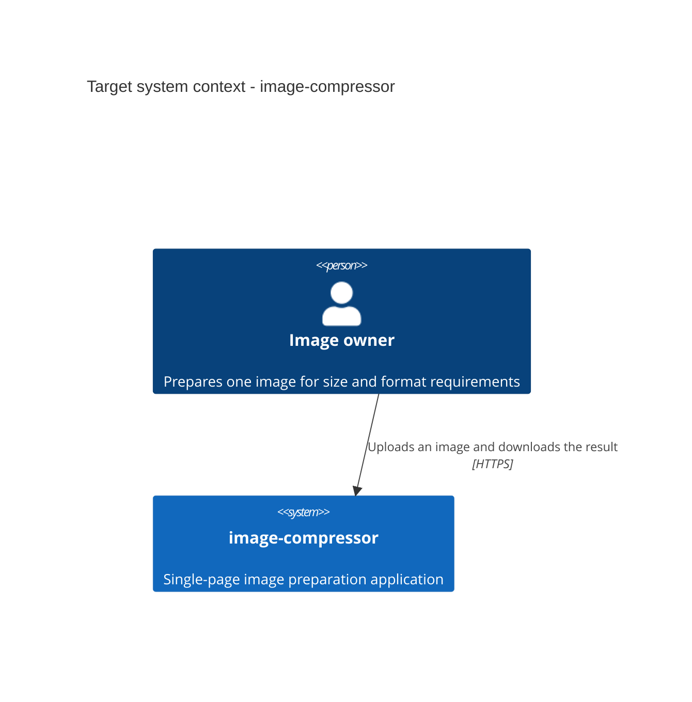
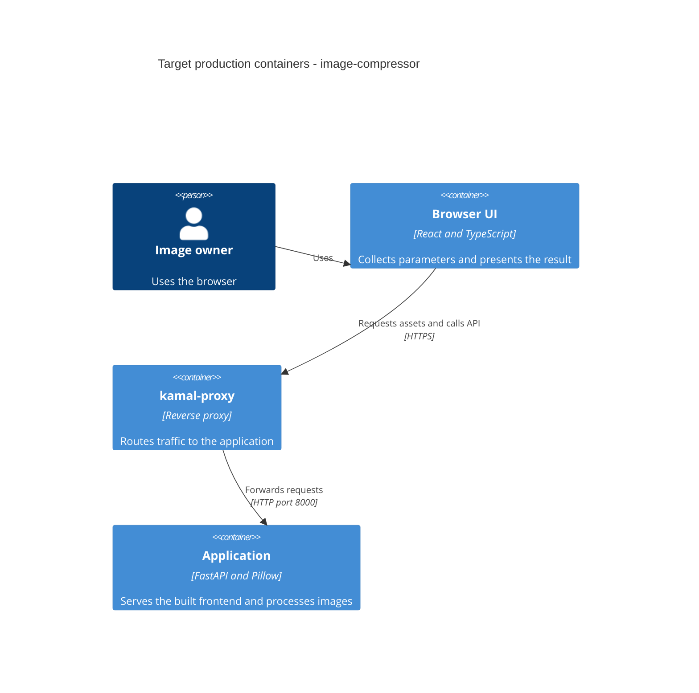

# Architecture map — image-compressor

This is the approved target foundation, not a description of running code. At the reflected commit the repository contains the product brief and ignore rules only. The machine commands above are the decided scaffold contract; they have not run against an application yet. Refresh this map after scaffold materializes the skeleton.

## Stack

- Backend: Python 3.14, FastAPI, Uvicorn and Pillow. uv owns the root Python project and its development dependencies. Frontend: React, Vite, TypeScript and Tailwind with npm — `docs/adr/0001-stack-and-development-tools.md:13`.
- Tool versions: root `mise.toml` selects Python, Node.js 24 LTS, uv and Ruby. Pin compatible patch versions at scaffold. Ruby is needed for deployment tooling; Kamal belongs in `Gemfile`, not mise's tool list — `docs/adr/0001-stack-and-development-tools.md:15`.
- Build: `npm --prefix frontend run build` runs TypeScript checking followed by Vite. Test: `uv run pytest`. Lint: `uv run ruff check .` and `npm --prefix frontend run lint` — `docs/adr/0001-stack-and-development-tools.md:34`.
- Setup: `mise run setup` installs all three ecosystems sequentially. Start: `mise run dev` launches both development servers in one terminal. Commands assume the repository root. The owner invokes setup; commands have no `mise exec` wrappers — `docs/adr/0001-stack-and-development-tools.md:21`.

## C4 — system as it is

The diagrams describe the target foundation. No application container or production deployment exists yet.





One application image contains backend code and built frontend assets. The browser UI is a logical client container, not a second deployed application service. Ruby and Kamal run on the deployment machine — `docs/adr/0002-single-service-and-kamal.md:29`.

## Module inventory

All application paths below are planned. Citation anchors refer to existing decision documents, not fabricated source files.

| Module | Path | Layers | Wired at | Responsibility |
|---|---|---|---|---|
| Backend | `backend/` | HTTP boundary; image functions added with the feature | Planned `backend/main.py`; ADR 0002 line 13 | Health endpoint, later upload validation and image transformations |
| Frontend | `frontend/` | React page and local state | Planned `frontend/src/main.tsx`; ADR 0002 line 25 | One page, native controls, result presentation |
| Development tooling | Repository root | mise tasks; uv, npm and Bundler manifests | Planned `mise.toml`; ADR 0001 line 21 | Reproducible setup and one-command startup |
| Container delivery | Repository root | Image build and deployment tooling | Planned `Dockerfile`; ADR 0002 line 16 | Build one application image for Kamal |

## Conventions (cited — the rules a new feature must match)

- **Module wiring / registration:** FastAPI entry point in `backend/main.py`; HTTP handlers call ordinary image functions. Do not scaffold unused processing abstractions — `docs/adr/0002-single-service-and-kamal.md:13`.
- **Error handling:** Pydantic validation at the HTTP boundary and standard FastAPI HTTP errors. Define feature-specific responses in the feature contract — `docs/adr/0002-single-service-and-kamal.md:23`.
- **IDs, persistence and migrations:** no persistent image IDs, database, object store or migration tool. `migration_tool: ""` means not applicable for this foundation — `docs/adr/0003-transient-image-processing.md:16`.
- **Tests:** pytest with HTTPX, Ruff, TypeScript and ESLint. The first runnable check is the skeleton smoke test, not a compression feature test — `docs/adr/0001-stack-and-development-tools.md:34`.
- **Inter-module communication and UI:** relative `/api` calls via fetch; Vite proxies during development. React local state and Tailwind provide the UI foundation — `docs/adr/0002-single-service-and-kamal.md:14` and `docs/adr/0002-single-service-and-kamal.md:25`.

## Datastores

| Store | Engine | Accessed via | Notes |
|---|---|---|---|
| Request-scoped upload | Memory or spooled temporary file | FastAPI `UploadFile` | Close on completion, errors and interruption |
| Current result | Process memory | Pillow output and HTTP response | Release after the response lifecycle; no later retrieval |

No persistent datastore or migration task applies — `docs/adr/0003-transient-image-processing.md:14`.

## Frontend / UI foundation

- **Component library / shared primitives:** no existing components and no third-party kit. Start with native accessible controls in the planned React page. Extract shared components only when actual reuse requires them — `docs/adr/0002-single-service-and-kamal.md:25`.
- **Styling / design tokens:** Tailwind through its Vite plugin. Reuse default Tailwind tokens initially; keep future application theme tokens in one planned `frontend/src/index.css`. There is no existing custom palette or typography system to copy — `docs/adr/0001-stack-and-development-tools.md:14` and `docs/adr/0002-single-service-and-kamal.md:25`.
- **State / data fetching:** React local state and fetch. No global state or server-cache library — `docs/adr/0002-single-service-and-kamal.md:14` and `docs/adr/0002-single-service-and-kamal.md:25`.
- **Closest UI precedent:** none yet. Scaffold creates the baseline `frontend/src/App.tsx` shell. The feature later adds the agreed single form; do not invent another workflow — `docs/idea-brief.md:41`.

## Where things live / closest precedents

There are no implemented feature precedents. The [scaffold tasks](features/_scaffold/tasks.json) establish the first runnable baseline.

- Add the health endpoint at the planned FastAPI entry point. `GET /api/health` returns 200 and `{"status":"ok"}`. Unknown `/api` paths return 404 — `docs/adr/0002-single-service-and-kamal.md:21`.
- Add the future image transformation functions in `backend/images.py`, independent of HTTP objects. Do not create that module before it has behavior — `docs/adr/0002-single-service-and-kamal.md:13` and `docs/adr/0002-single-service-and-kamal.md:23`.
- Compose the future form in the React page using the UI foundation above. Preserve the brief's independently optional limits — `docs/idea-brief.md:43`.

### Root development commands

The following task definitions are the approved target for `mise.toml`. They are not installed by survey. S1 and S2 generate the manifests and lockfiles before setup can run.

```toml
[tasks.setup]
run = [
  "uv sync --locked",
  "npm --prefix frontend ci --include=dev",
  "bundle install",
]

[tasks.dev]
depends = ["dev:backend", "dev:frontend"]

[tasks."dev:backend"]
run = "uv run uvicorn backend.main:app --reload --reload-dir backend --port 8000"

[tasks."dev:frontend"]
run = "npm --prefix frontend run dev -- --port 5173 --strictPort"
```

Setup stops on the first error. Dev runs both servers concurrently, with reload and separate log prefixes. Verify startup from the root and Ctrl+C cleanup, including reload children. `http://localhost:5173` is the development page; `/api` proxies to `http://127.0.0.1:8000` — `docs/adr/0001-stack-and-development-tools.md:21` and `docs/adr/0002-single-service-and-kamal.md:14`.

### Deployment foundation

Scaffold adds the multi-stage Dockerfile and a container smoke check. The final image runs Uvicorn without reload on port 8000 and serves the built frontend. Use locked application dependencies and exclude local environments, secrets and development tools from the runtime image — `docs/adr/0002-single-service-and-kamal.md:16`.

Kamal runs through `bundle exec kamal`. Its future configuration uses `proxy.app_port: 8000` and healthcheck `/api/health`. Deployment infrastructure values and live rollout are outside survey and scaffold. GitHub Actions checks build, tests, lint and the image without deploying — `docs/adr/0002-single-service-and-kamal.md:17` and `docs/adr/0002-single-service-and-kamal.md:31`.

## Constraints & known tech-debt

- Product scope: one image and one form; no batch processing, history, presets, cropping or stretching — `docs/idea-brief.md:28`.
- Width, height and file-size limits are independently optional. Preserve aspect ratio; dimensions may decrease to satisfy file size — `docs/idea-brief.md:41` and `docs/idea-brief.md:43`.
- Formats, input limits, minimum quality and dimensions, unattainable targets and interrupted transfers need feature specification before processing code is written — `docs/idea-brief.md:49` and `docs/adr/0003-transient-image-processing.md:17`.
- Build, test and runtime behavior remain unverified until scaffold. Exact framework and tool patch versions are resolved and locked there. No existing implementation debt has been identified because no source exists — `docs/adr/0001-stack-and-development-tools.md:15`.

## Reconciliation with the authored architecture doc

No authored architecture document, root CLAUDE.md or pre-existing ADR was present. The existing Ukrainian [idea brief](idea-brief.md) remains unchanged. This map records the owner's approved foundation and later corrections: mise for tools, Bundler for Kamal, `mise run setup` for all dependency installs, and `mise run dev` for both servers.

The root repository had no commits. Commit `1cd6142` records the unchanged brief and ignore rules and supplies the truthful baseline for `reflects_commit`. The subsequent survey commit contains only this map, its three ADRs and the scaffold tasks. `_scaffold` has no feature size or pipeline route; neither applies to this repository-level stage.
