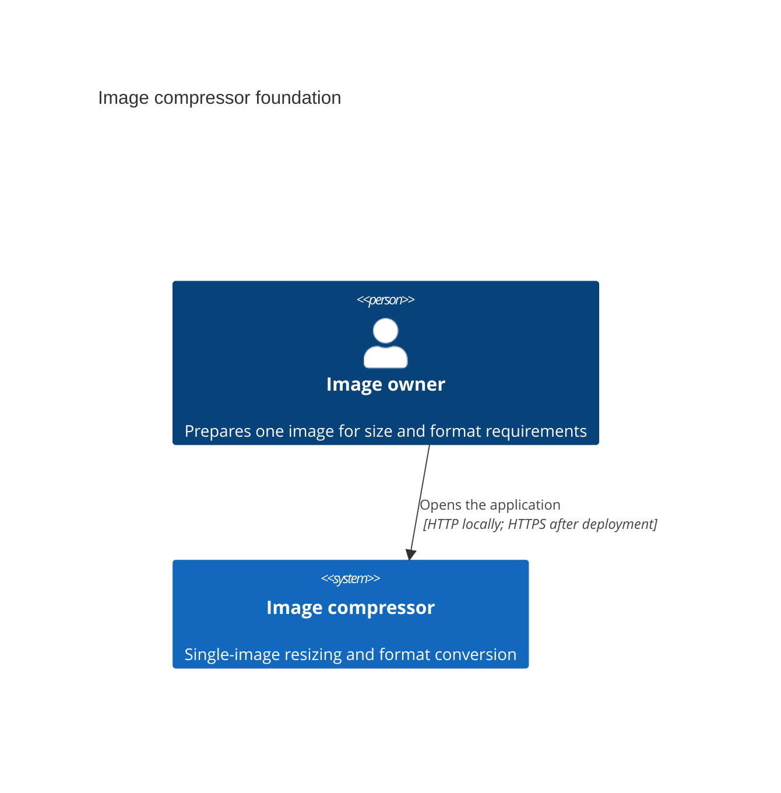
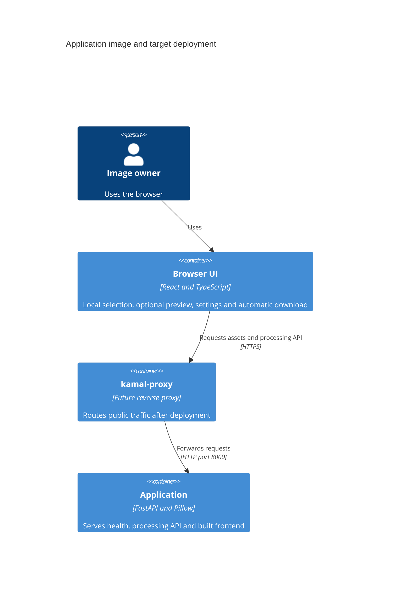

# Architecture map — image-compressor

The foundation and image-resize-convert implementation are materialized. [Feature tracker](features/image-resize-convert/tasks/tracker.md) records completed implementation and browser/security acceptance. [Scaffold tasks](features/_scaffold/tasks.json) retain setup evidence. Hosted GitHub Actions and public deployment remain unverified. Roadmap step 3 `image-size-limit` is an idea, not implemented.

## Stack

- Python 3.14, FastAPI, Uvicorn, Pillow 12.3.0 and pillow-heif 1.6.0. Starlette 1.6.0 and python-multipart 0.0.22 are pinned for bounded parsing; Pillow bundles the LittleCMS binding used for color profiles. uv owns the root project and default development dependencies — `pyproject.toml:1` and `uv.lock`.
- React, Vite, TypeScript and Tailwind use npm — `frontend/package.json:1` and `frontend/package-lock.json`. TypeScript stays on 6.0.x to satisfy typescript-eslint peer requirements.
- mise pins Python 3.14.6, Node.js 24.18.1, uv 0.12.9 and Ruby 4.0.5 — `mise.toml:1`. `UV_PYTHON` points to mise's interpreter; uv owns `.venv` — `mise.toml:7`.
- Kamal is declared in `Gemfile:3` and locked to 2.12.0. Ruby and Bundler are deployment tools, outside the application runtime.
- Build, test and lint commands in frontmatter ran successfully. Build the frontend before pytest; the smoke test requires emitted assets — `tests/test_smoke.py:23`.

## C4 — system as it is

The application image exists and runs locally. Image resizing and conversion are implemented; browser/security acceptance is recorded in the feature audits. The public proxy and deployment below remain the target topology.





One image contains backend code and built frontend assets. The browser UI is a logical client, not a second deployed service. Local checks access the application directly without a proxy — `Dockerfile:17` and `docs/adr/0002-single-service-and-kamal.md:29`.

## Module inventory

| Module | Path | Wired at | Responsibility |
|---|---|---|---|
| Backend | `backend/` | `backend/main.py:5` | HTTP validation, bounded multipart, safe errors, response ownership and frontend serving |
| Image functions | `backend/images.py` | `backend/main.py` | Static decoding, HEIF timelines, resize, color normalization and encoding |
| Frontend | `frontend/` | `frontend/src/main.tsx:6` | Local selection/preview, one current request, download/reset and error retry |
| Development tooling | Repository root | `mise.toml:13` | Sequential setup and concurrent dev servers |
| Container delivery | Repository root | `Dockerfile:17` | One non-root application image |
| Verification | `tests/`, `.github/workflows/` | `tests/test_smoke.py:18`, `.github/workflows/ci.yml:1` | Shared in-process and live-container smoke scenarios |

## Conventions

- **Module wiring:** FastAPI entry point and health handler — `backend/main.py:5`. The processing handler calls ordinary functions in `backend/images.py` directly — `docs/adr/0002-single-service-and-kamal.md:13`.
- **HTTP errors:** validate multipart fields manually at the HTTP boundary and return safe FastAPI errors. `POST /api/v1/images/process` returns complete binary output with attachment headers; its contract is `docs/features/image-resize-convert/contracts/openapi.yaml` — `docs/adr/0002-single-service-and-kamal.md:23`.
- **Frontend serving:** `app.frontend` serves the build with fallback disabled, preserving API 404s — `backend/main.py:13`. Registration is conditional on the build directory so the API boots before a build exists. Restart the backend after the first build.
- **Tests:** pytest and HTTPX check health, built HTML, emitted JS/CSS, a PNG→WebP process call and unknown API paths with JSON and HTML Accept headers — `tests/test_smoke.py:23`. `test_heic_notice_copy` pins the form HEIC/HDR disclaimer — `tests/test_smoke.py:18` and `frontend/src/App.tsx:189`. `oriented-exif6.jpg` is the Preview/download orientation control — `tests/fixtures/images/README.md:18`. `SMOKE_BASE_URL` runs the same scenarios against a live container. Ruff, TypeScript and ESLint provide static checks.
- **UI communication:** browser processing uses relative `/api/v1/images/process` fetch calls. Vite proxies `/api` to the backend — `frontend/vite.config.ts:8`. Use React local state; no global store, server-cache library or client router.

## Datastores

No persistent datastore, image IDs, object store, queue or migration tool exists. `migration_tool: ""` means N/A, not a missing command — `docs/adr/0003-transient-image-processing.md:16`.

Uploads use request-scoped spooled `UploadFile` storage. Parsing limits file bytes to 20,000,000 and decoding limits pixels to 40,000,000. A shielded executor operation owns the upload until native work finishes; ExitStack closes decoded/intermediate images. The response clears encoded bytes after completion or send failure. No image or filename is logged; parser diagnostics are disabled — `docs/adr/0003-transient-image-processing.md:13`.

## Frontend / UI foundation

- **Closest precedent:** `frontend/src/App.tsx` owns the single form with independently optional dimension limits and JPEG/PNG/WebP selection. Local preview URLs are revoked on replacement, failure, success and teardown. The HEIC primary-image/HDR disclaimer sits under the format field — `frontend/src/App.tsx:189`. A new file-size control would extend this fieldset, not a second screen — `frontend/src/App.tsx:177`.
- **Components:** native accessible controls and React local state. Extract shared components only for actual reuse; no third-party component kit — `docs/adr/0002-single-service-and-kamal.md:25`.
- **Styling:** Tailwind Vite plugin — `frontend/vite.config.ts:6`. Typography, canvas, ink, muted and accent tokens live in `@theme` — `frontend/src/index.css:3`. Surface, line and danger tokens are a second `@theme` block — `frontend/src/index.css:28`. The feature must retain deliberate spacing and a clear primary action, with the form as the focus — `docs/idea-brief.md:47`.
- **Motion:** CSS entry motion runs only under `prefers-reduced-motion: no-preference` — `frontend/src/index.css:17`. `prefers-reduced-motion: reduce` disables animation and transition — `frontend/src/index.css:45`. Controls use native labels, keyboard focus and a truthful busy state without percentages. One AbortController identifies the current request; complete Blob handoff happens once, then the result URL is revoked and the native file input resets. Recoverable errors preserve selection; pagehide invalidates work — `docs/idea-brief.md:49` and `docs/adr/0002-single-service-and-kamal.md:25`.
- **Acceptance:** Chrome flow checks and native Safari/Firefox downloads are recorded in [browser acceptance](features/image-resize-convert/_audit/browser-acceptance.md). The owner confirmed download/reset on iOS and desktop Safari/Firefox and accepted phone/desktop readability. Firefox/WebKit engine failure/retry/interruption checks and native Safari server-error retry pass; the owner confirmed real iPhone Safari network-failure/retry and form reset.

## Root development commands

The owner runs `mise run setup` after installing the pinned tools. Setup sequentially runs `uv sync --locked`, `npm --prefix frontend ci --include=dev` and `bundle install` — `mise.toml:13`. Both successful runs in a disposable repository copy preserved all lockfile hashes. An invalid uv.lock stopped execution before npm or Bundler.

`mise run dev` starts both dependency tasks with two task slots — `mise.toml:10` and `mise.toml:20`:

```sh
uv run uvicorn backend.main:app --reload --reload-dir backend --port 8000
npm --prefix frontend run dev -- --port 5173 --strictPort
```

Open <http://localhost:5173>. Vite proxies `/api` to <http://127.0.0.1:8000>. Root startup, prefixed logs, backend reload and browser HMR passed. One Ctrl+C stopped both servers and reload children and released ports 8000 and 5173. mise reports an interrupted task as an error; process cleanup still passed. Dev never invokes setup. Commands use no `mise exec` wrappers.

## Container and CI

`Dockerfile:1` builds the frontend with Node.js 24 and installs locked Python runtime dependencies in a separate stage. `Dockerfile:17` runs Python 3.14 as UID 10001, serves built assets and starts Uvicorn on port 8000 without reload. `.dockerignore:1` allowlists build inputs and excludes local dependencies and environment files.

`docker build -t image-compressor:smoke .` passed on Linux arm64. Live-container `SMOKE_BASE_URL=http://127.0.0.1:8000 uv run pytest` passed. Runtime inspection confirmed Node.js, npm, Ruby, uv, Ruff and pytest are absent.

`.github/workflows/ci.yml:1` uses mise and locked dependencies for build, pytest, Ruff, ESLint, Bundler checks and the same container smoke scenarios. actionlint passed. Hosted execution is unverified; no deployment runs from CI.

Kamal runs through `bundle exec kamal`. A future deployment configuration uses `proxy.app_port: 8000` and health path `/api/health`. Server addresses, domain, registry and credentials require a separate deployment task — `docs/adr/0002-single-service-and-kamal.md:17`.

## Implemented scope and remaining acceptance

- One image and one form; no batch processing, history, presets, cropping or stretching — `docs/idea-brief.md:28`.
- Width and height are independently optional; preserve aspect ratio with no enlargement. A target output file size is outside `image-resize-convert`. Roadmap step 3 [`image-size-limit`](roadmap.md) (idea, size S) extends the same form and `POST /api/v1/images/process`. Roadmap sketches automatic dimension reduction to meet a byte limit — `docs/roadmap.md:24`. Current AC-05 forbids extra shrink beyond supplied bounds — `docs/features/image-resize-convert/spec.md:90`. Specify must close D2 before that collision is resolved — `docs/roadmap.md:44`.
- Static JPEG/PNG/WebP/HEIC input becomes JPEG/PNG/WebP output. JPEG uses white behind alpha; metadata is stripped after orientation. HEIC primary-image selection and HDR-to-SDR normalization are implemented. Codec output dimensions above WebP 16,383 or JPEG 65,500 return actionable 422, as approved in the feature amendment.
- Independent Security Lead technical review passed. Hosted CI and public deployment remain unverified; real iPhone Safari network-failure/retry is owner-confirmed. Android is owner-deferred; migrations are N/A.

## Reconciliation

The [idea brief](idea-brief.md) and accepted [ADRs](adr/) remain authoritative for product and foundation decisions. `README.md` documents the runnable commands; `CLAUDE.md` records project conventions. The local SDD settings remain unchanged.

Commit `1cd6142` records the brief; `5e334ab` establishes the foundation; `616dca8` adds visual requirements; `86ac0c5` ships the image-resize-convert changelog and marks that roadmap step shipped. The image feature extends that foundation without new service or datastore boundaries. `_scaffold` is a repository stage with no feature size or pipeline route. This map is a brownfield scan of the materialized system (`mode: current`).
