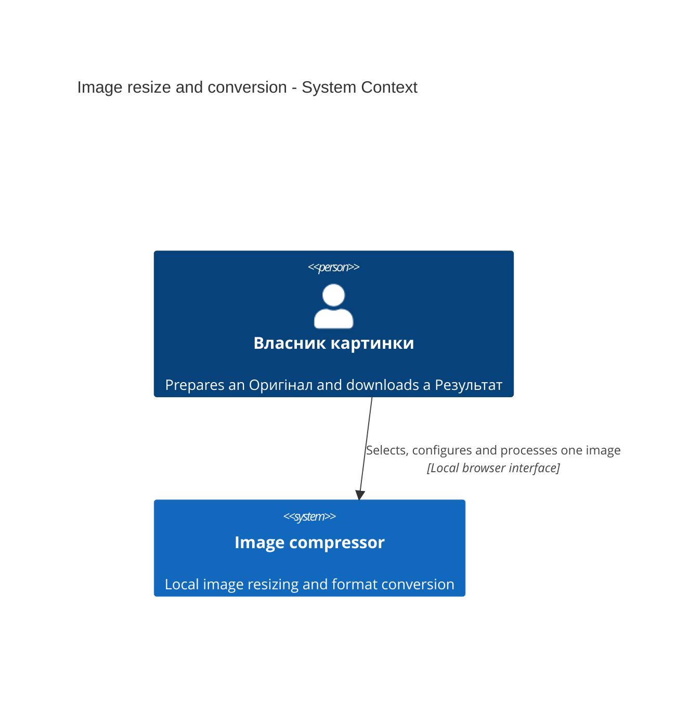
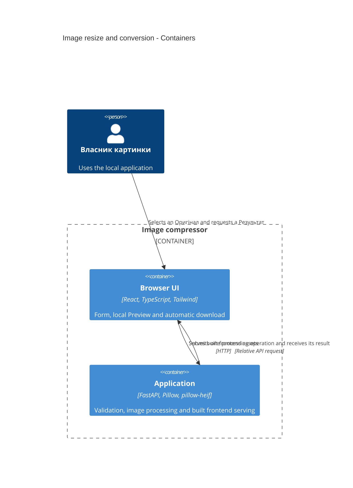
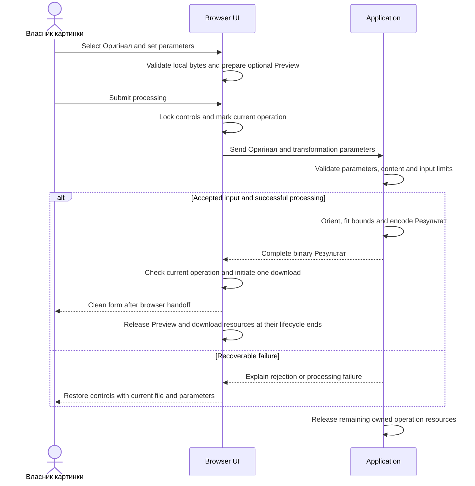

# Software Architecture Document — image-resize-convert

## 1. Introduction and goals

**Intent.** Give Власник картинки a local, single-page workflow to select an Оригінал, optionally inspect its local Preview, apply independently optional Максимальні розміри, choose JPEG, PNG or WebP, and receive one automatic download of the Результат followed by a clean form. The canonical requirements are [spec.md](./spec.md), including its automatic-download amendment, and [ux-flows.md](./ux-flows.md).

**Top-3 quality goals:**

1. Correct transformations: preserve the whole oriented image, fit supplied bounds without enlargement, and produce the agreed format, transparency and color behavior.
2. Transient private resources: upload only on submission, retain no server image for retrieval, and release each resource at its operation or browser-handoff boundary.
3. Accessible, recoverable interaction: one active operation, truthful busy state, retained input after recoverable failure, and automatic download followed by reset.

**Stakeholders.**

| Role | Interest | Sign-off owner? |
|---|---|---|
| Власник картинки | Correct downloaded images and an accessible local workflow | Yes, product and manual contrast acceptance |
| Tech Lead | Architecture, HEIC feasibility and resource ownership | Yes |
| Security Lead | Untrusted decoding and temporary-resource handling | Yes, before implementation acceptance |

**Decision override:** Use four feature ADRs rather than the skill's M-size guideline of 5–12. The project owner explicitly approved four substantive records with references to existing foundation decisions, avoiding duplicate stack, SPA and storage ADRs.

The owner approved depth medium, size M and route standard. Documents remain English, matching this feature folder; the canonical domain terms remain unchanged. Approval of architectural choices does not claim that the outstanding runtime checks in §11 have passed.

## 2. Constraints

**Technical.** Reuse Python 3.14 (mise pins 3.14.6), FastAPI 0.141.1, Starlette 1.6.0, Uvicorn 0.52.4 and Pillow 12.3.0 from the existing foundation and Python lockfile. Reuse React, Vite, TypeScript and Tailwind with the existing npm lockfile; no frontend framework migration is part of this feature. The application has no datastore, queue or result repository.

**Organisational.** This is the project owner's local tool. No deadline, effort budget, public launch, throughput target or latency measurement is required. The owner runs setup. Tech Lead resolves the design feasibility gates before tasks; Security Lead reviews the introduced decoding boundary before implementation acceptance.

**Conventions.** Follow [AGENTS.md](../../../AGENTS.md), the [architecture map](../../architecture-map.md) and [foundation ADRs](../../adr/). HTTP validation belongs in `backend/main.py`; ordinary image functions belong in `backend/images.py` when implemented. React uses local state, native accessible controls, relative API fetches and theme tokens in `frontend/src/index.css`. Preserve API 404s and backend startup before the first frontend build. Use root mise tasks and existing uv, npm and Bundler lockfiles.

**Privacy / external constraints.** Images are confidential. Inputs permit at most 20,000,000 bytes and 40,000,000 decoded pixels of the selected static image, with equality allowed. Preserve the agreed transient lifecycle and omit identifying image metadata and image content from logs. Accounts, persistent retrieval, animation output, public deployment, analytics and performance benchmarks are outside this feature. No additional regulatory regime is asserted.

The HEIC plugin and multipart package are planned implementation dependencies, not changes made by this documentation stage. Their absence from the current environment is not permission to omit HEIC or replace request-scoped UploadFile storage.

## 3. Context and scope

Власник картинки selects one Оригінал and receives a transformed Результат through the local Image compressor. Preview is prepared in the browser and is optional; selection and parameter edits never upload a file. The server treats uploaded content and parameters as untrusted, independently of browser validation.

The [architecture map](../../architecture-map.md) remains the brownfield source: its materialized foundation is commit `1837854`; inspection through `81326d5` found only documentation and convention changes after that scaffold. The implementation still contains a React shell and health/static-serving endpoints, without image processing. No repository re-scan or new architecture-map artifact is needed.

| Actor or system | Type | Interaction |
|---|---|---|
| Власник картинки | Person | Selects an Оригінал, requests processing and receives a Результат |
| Native browser facilities | Client platform | Optional local image display, file selection and download handoff |
| External application services | None | No third-party processing, identity provider or remote storage |

**Trust boundary.** Browser restrictions are usability controls. The Application enforces file presence, supplied parameters, actual file bytes, supported content, animation rules and decoded pixel limits. A result belongs only to its active response; there is no lookup capability that could expose another operation.

**C4 Context (L1):**

The owner confirmed this context in prose: one local application and no external application services.

## 4. Solution strategy

1. **Extend the existing web and backend surfaces.** Declare `target_surfaces: [web-frontend, backend-service]`. The web surface is the existing React SPA with local state, no client router and native controls. The backend surface is the existing FastAPI application. These are logical C4 containers, not two deployed services. Reuse existing theme tokens and reduced-motion behavior. [ADR 0001](./adr/0001-extend-web-frontend-and-backend-service.md) records the surface contract and inherits [foundation ADR 0002](../../adr/0002-single-service-and-kamal.md).

2. **Use one Pillow processing pipeline with a HEIC plugin.** Plan `pillow-heif` as the Pillow plugin, retaining normal Pillow handling for JPEG, PNG and WebP. Select only the designated HEIC primary static image. A HEIC collection is not rejected merely because the plugin reports multiple frames; actual animation remains rejected. Disable unneeded thumbnail, depth and auxiliary-image processing without discarding primary-image transparency. Normalize visible orientation exactly once before applying bounds. [ADR 0002](./adr/0002-load-heic-through-pillow-plugin.md) records this choice over a separate direct HEIC loader.

3. **Preserve compatible color interpretation.** Keep a compatible color profile rather than converting every image to sRGB. When the pixel color model changes, perform the required color transformation with Pillow ImageCms and retain only a profile matching the resulting pixels. Never relabel transformed pixels with an incompatible source profile. HEIC NCLX-only color information and PNG color information without ICC require the feasibility evidence in §11; silently discarding that information is not the chosen policy. Remove GPS, camera, EXIF, XMP and textual service metadata after orientation has been applied. JPEG composites transparency onto white; PNG and WebP retain it. [ADR 0003](./adr/0003-preserve-compatible-color-profiles.md) records this choice.

4. **Return the result within the submitted operation.** Send one processing request and receive its complete binary result. The browser uses a Blob URL and an automatic download action only for the current pending operation. Clear the form after handoff while keeping download cleanup independent of form state. Failure retains the current input for retry; obsolete completions never download or restore state. Server work remains request-scoped without jobs or retrieval IDs. [ADR 0004](./adr/0004-return-results-within-the-current-operation.md) defines ownership and the outstanding handoff proof.

The form defaults to JPEG on every selection and reset. Either dimension is optional. A supplied format counts as a transformation parameter; supplied dimensions with omitted format use JPEG, while omission of all parameters remains an error. Encoding adds no quality control or smaller-file guarantee. The processing contract's paths, field names, error schema and status codes belong to `sdd:api`, not this architectural decision.

## 5. Building block view

Use the existing division between the browser, the HTTP boundary and ordinary image functions. The backend calls image functions directly; it does not introduce repository, adapter, service-class or worker layers. Image functions do not depend on FastAPI request or response objects.

| Location | Responsibility |
|---|---|
| `frontend/src/App.tsx` | SCR-01 form, current selection and operation state, optional Preview, download and reset |
| `frontend/src/index.css` | Existing theme tokens and motion rules |
| `backend/main.py` | HTTP validation, request/response resource ownership and mapping processing failures to HTTP errors |
| `backend/images.py` | Decode, orient, preserve color interpretation, calculate bounded dimensions and encode |
| `tests/` | Existing smoke coverage plus specified processing and lifecycle behavior when implemented |

Pillow and pillow-heif are libraries inside Application, not containers. Native decoding must not block the asynchronous HTTP event loop. Its execution and cleanup remain owned until the image function finishes; browser cancellation is not a guarantee that native decoding stops immediately. At most one submission is promised per current form, not as a new system-wide concurrency guarantee.

**C4 Container (L2):**

The owner confirmed these two containers and their responsibility split. Development uses the existing Vite proxy; the built application serves frontend assets directly.

## 6. Runtime view

**Critical flow: process, download and reset, with recoverable failure.**

**Selection.** Every new selection clears the old Preview and resets format and bounds, including invalid selections. Reject empty files and files above the byte limit before preparing Preview. A current native-image load failure silently omits Preview. Delayed work cannot restore a prior selection. Preview availability never gates an otherwise eligible submission.

**Validation and transformation.** Enforce parameters at the HTTP boundary. Bound upload parsing and validate actual file bytes before expensive decoding. Inspect supported content, static-image rules and selected-image dimensions before full pixel decoding; preserve decoder safety protections and verify decoded dimensions again where a decoder can change them. Apply orientation before calculating dimensions. Use the largest proportional scale not exceeding one or either supplied bound; round each dimension to the nearest whole pixel with halves up and minimum one. The specified 1000 by 333 image with width 500 must become 500 by 167; an unverified library thumbnail rounding rule is not a substitute. Ineffective bounds and same-format requests still normalize the output.

**Completion.** Wait for the whole successful response before attempting a download. Recheck that the operation is current and not consumed. Hand the Blob URL to a native download action once, with the requested format and matching filename extension, then return to the initial form. Reset clears the native file input too, allowing the same file to be selected again. No result panel, repeat-download control or result object remains in application state.

**Failure and interruption.** Recoverable validation, processing and transfer errors restore controls with the same selected file and parameters. Closing or reloading invalidates browser work without restoration. The server closes upload handles and image resources on success, errors and interruption; native work may finish before its resources can be closed. The response owns encoded output only until response completion or failure. No prior result can be restored. The diagram shows logical lifecycle completion, not permission to keep a decoded image alive throughout a response unnecessarily.

Download URL release must not be driven by form reset or assumed to follow a disk-save event. Its safe handoff boundary remains a mandatory browser feasibility gate in §11. `sdd:sequences` expands this seed into full user-story and AC branch coverage.

## 7. Deployment view

Reuse root `mise run dev` for the two development servers and the existing single Docker application image for the local built application. The browser is a client of that image, not another production service. The runtime stays non-root, with built frontend assets and Python dependencies; no Node.js, Ruby or development tools are added to it.

Pillow-heif introduces native decoder packaging to verify on the local macOS environment and Linux application image. Published CPython 3.14 wheels exist for macOS and Linux on arm64 and x86_64 in [pillow-heif 1.6.0](https://pypi.org/project/pillow-heif/1.6.0/); package availability is not proof of the required runtime behavior. Resolve and lock implementation dependencies with the existing uv workflow only when implementing.

| Concern | Decision |
|---|---|
| Health and logs | Preserve the existing health endpoint and stdout/stderr; do not log image content or identifying image metadata |
| Metrics, alerts and tracing | No new collection; this local feature excludes analytics and timing measurements |
| Scaling thresholds | N/A: no agreed throughput, replica or public-service availability target |
| Public hosting | N/A: no Kamal deployment configuration, registry or infrastructure changes in this feature |

Preserve built-asset smoke coverage and API 404 responses. Restart the backend after the first frontend build when it initially started without `frontend/dist`.

## 8. Crosscutting concepts

| Concept | Convention | Source |
|---|---|---|
| Authentication and isolation | No accounts or ownership claims; no history, persistent result IDs or result lookup | Spec AC-14; foundation ADR 0003 |
| Errors | HTTP validation and standard FastAPI errors at the boundary; image functions report failures without HTTP objects; readable UI errors retain input when recoverable | Foundation ADR 0002; spec AC-11, AC-12, AC-15 |
| Logging | No pixels, original filenames, identifying metadata or raw uploads in logs, including error details | Spec §6.1; owner-approved privacy policy |
| Browser state | React local state for the current form; an operation identity/currentness guard prevents stale or duplicate completion; no image persistence or restoration | Spec AC-03, AC-13–AC-16 |
| Resource ownership | Each upload, image, output and object URL has an explicit owner and cleanup path; see the table below | Foundation ADR 0003; ADR 0004 |
| Accessibility and motion | Native controls, labels, keyboard access, visible focus, manual readable-contrast acceptance and reduced motion without loss of function | Spec §6; existing theme |
| Storage and events | No database, migrations, object storage, background queue or application event bus | Foundation ADR 0003 |

| Resource | Owner | Release boundary |
|---|---|---|
| Selected File and Preview URL | Current browser selection | New selection, successful handoff/reset or page teardown; a failed Preview is discarded |
| Multipart parser and UploadFile | Current server request | Close partial uploads on parse failure/disconnection; close completed uploads once image processing no longer needs them |
| Decoder, native image and intermediate images | Image-processing function | Structured cleanup on success or exception; interruption cannot discard ownership while native work is still using a resource |
| Encoded output | Current response | Release processing temporaries after encoding and response-owned output after completion or failure |
| Result Blob URL | Browser download handoff | Release as soon as the browser no longer needs the URL for handoff; form reset must not revoke it prematurely |

The server must enforce limits even when form controls are bypassed. Multipart storage needs bounded file and field handling; a parser's text-part limit alone must not be mistaken for a file-byte limit. The cleanup gate includes incomplete multipart input, not only successful UploadFile creation. Detailed boundary mechanics and the wire contract are verified before implementation planning rather than hidden behind an invented universal timeout.

## 9. Architecture decisions

| # | Title | Status | Section |
|---|---|---|---|
| [0001](./adr/0001-extend-web-frontend-and-backend-service.md) | Extend the web frontend and backend service | Accepted | §4, §5 |
| [0002](./adr/0002-load-heic-through-pillow-plugin.md) | Load HEIC through the Pillow plugin | Accepted | §4, §7 |
| [0003](./adr/0003-preserve-compatible-color-profiles.md) | Preserve compatible color profiles | Accepted | §4, §6 |
| [0004](./adr/0004-return-results-within-the-current-operation.md) | Return results within the current operation | Accepted | §4, §6, §8 |

The four records are the complete feature ADR set. Root [ADR 0001](../../adr/0001-stack-and-development-tools.md), [ADR 0002](../../adr/0002-single-service-and-kamal.md) and [ADR 0003](../../adr/0003-transient-image-processing.md) remain authoritative for stack, local development, SPA delivery, module conventions and absence of persistent storage.

The owner explicitly chose four records rather than splitting the cohesive request/download lifecycle solely to reach the M-size count guideline. Surface selection records the inherited downstream contract without fabricating an alternative that the foundation already excludes. HEIC integration, color policy and lifecycle decisions record their actual choices and consequences.

## 10. Quality requirements

Targets below come from [spec.md §6](./spec.md#6-non-functional-requirements). Transformation examples come from §5 ACs and are not new performance targets.

**QG-1. Correct transformations and bounded input.**

- **When:** A file and supplied transformation parameters reach the processing boundary, including requests bypassing the form.
- **Then:** Input limits are “At most 20,000,000 bytes and 40,000,000 decoded pixels of the selected static image; equality allowed”. Reject empty, corrupted, unsupported and animated content under the HEIC primary-image rule. Produce the chosen supported output with the specified orientation, bounds, transparency and metadata behavior.
- **How verify:** Existing pytest/HTTPX tools exercise missing parameters, dimensions-only JPEG fallback, invalid bounds and output choices, exact-limit and over-limit inputs, disguised content and failures before full decoding. Verify all 12 supported input/output combinations, designated HEIC primary image, HDR-to-8-bit behavior, the AC-04 dimensions and AC-05 half-up example, no enlargement, same-format normalization, white JPEG alpha compositing, retained PNG/WebP alpha and compatible color interpretation after metadata removal.

**QG-2. Local Preview and transient private resources.**

- **When:** Selection, parameter editing, processing, response transfer, failure, interruption or browser download handoff occurs.
- **Then:** Preview locality is “Zero file-upload requests caused by selection, parameter editing or Preview preparation”. Transient resources are “Zero retained upload handles, decoded images or result buffers after their operation lifecycle; zero image content in logs”. Allocator-reserved memory is not a retained image.
- **How verify:** Observe browser requests during selection/editing and optional Preview failure. Exercise parser interruption, decoder failure, transfer failure and normal completion with explicit handle/reference ownership checks. Inspect logs. Prove that form reset releases Preview resources without breaking the initiated download, and that download resources are released after handoff without creating another download capability. Reload must restore neither file nor result.

**QG-3. Accessible interaction and recovery.**

- **When:** Власник картинки completes, retries or repeats the flow in the browser.
- **Then:** Form concurrency is “At most one submitted processing operation from the current form; file selection and all transformation parameter controls disabled while processing”. Accessibility requires “Every interactive control is keyboard-usable with visible focus; every label, error and action passes the project owner's manual readable-contrast review; with reduced motion, zero decorative animations and zero loss of functionality”. Responsive UI requires “Complete flow at viewport widths 360 and 1280 CSS pixels with no horizontal page overflow”.
- **How verify:** Exercise the complete keyboard flow, owner contrast acceptance and reduced-motion review at both widths. Verify disabled controls and duplicate-submit suppression, silent unavailable Preview, conditional JPEG warning and general HEIC notice, one complete download per success, a clean form with no result controls, same-file reselection, consecutive conversions, retained input after recoverable failure and ignored stale completions. The owner selected desktop Chrome, Safari and Firefox, iPhone Safari and Android Chrome for browser verification. Viewport emulation alone does not prove mobile download behavior.

**AC traceability.**

| Criteria | Architecture | Verification focus |
|---|---|---|
| AC-01–AC-03 | §3, §5, §6 Selection | Local eligibility, optional oriented Preview, reset and stale selection |
| AC-04–AC-06 | §4, §6 Validation and transformation | Exact geometry, rounding, no enlargement, normalized ineffective requests |
| AC-07–AC-10 | §4, ADR 0002–0003 | Format matrix, transparency, orientation, metadata and HEIC notices/primary/HDR |
| AC-11–AC-12 | §3, §6, §8 | Bypassed UI, invalid parameters, actual content and exact input limits |
| AC-13–AC-16 | §6, §8, ADR 0004 | One download, reset, no lookup, retry and all cleanup paths |

Feature implementation uses existing tests before introducing new test files or tools. No new browser test infrastructure is authorized by this SAD. Preserve the existing smoke test. After code changes run `npm --prefix frontend run build` before `uv run pytest`, then `uv run ruff check .` and `npm --prefix frontend run lint`. Run the shared smoke test against the application image with `SMOKE_BASE_URL`. These implementation checks are not claimed as executed by this documentation stage.

## 11. Risks and technical debt

<!-- 🎯 Why: ⭐ collects EVERYTHING that can break — not only the technical. Without §11 risks get
     discussed at standups and lost; debt lives only in the head of whoever accepted it.
     📋 Write: a risk/debt table — severity — mitigation — owner. Accepted debt in its own block.
     📌 The first risk is often a product risk, not a technical one. That's normal. -->

<!-- Severity literals: Low / Medium / High for regular risks; "Open question" for rows created by
     a Save-as-OQ resolution during the Socratic walk (see references/socratic.md). -->

| Risk / debt | Severity | Mitigation | Owner |
|---|---|---|---|
| <e.g. Worker lag may reach hours during a downstream outage> | Medium | <alert >10 min, on-call playbook, retry backoff> | <DevOps> |
| <e.g. No event-schema versioning in v1> | Medium | <ADR-NNNN planned for v2, tolerate unknown fields> | <Backend> |
| Open architectural decision: <decision-headline> | Open question | Resolve before <stage trigger or YYYY-MM-DD>; <inline rationale from the Save-as-OQ> | <owner> |

**Accepted debt (acceptable in v1, plan to fix later):**
- <e.g. the entity is immutable / unversioned — OK for v1, may need audit versioning in v2>

## 12. Glossary

<!-- 🎯 Why: ⭐ the DOMAIN GLOSSARY that ends arguments a year later («checkpoint — weekly or
     biweekly? quarter — calendar or fiscal?»).
     📋 Write: a term / meaning table. Business + technical terms mixed.
     📌 e.g. «Lesson | a unit inside a course made of blocks (text, video)». -->

| Term | Meaning |
|---|---|
| <e.g. domain object A> | <its meaning in this domain> |
| <e.g. domain object B> | <its meaning> |
| <e.g. domain invariant name> | <the rule, in plain language> |
