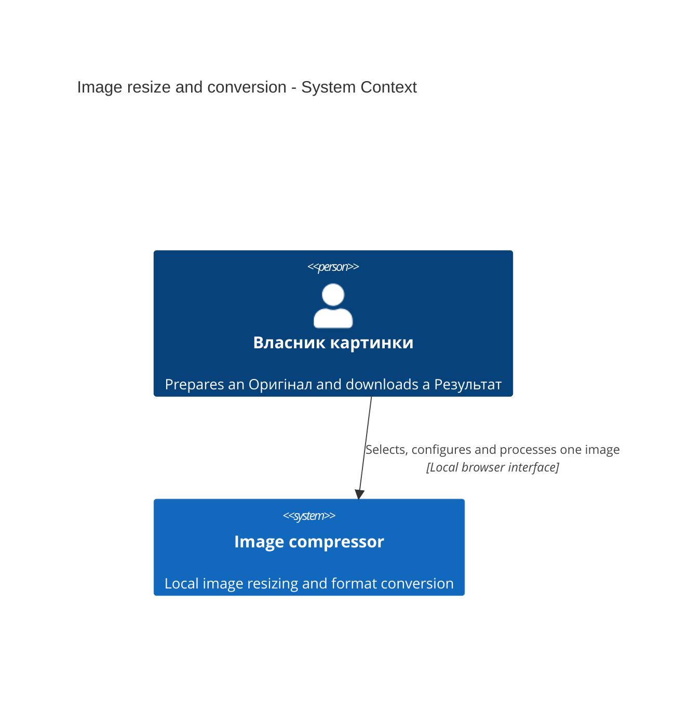
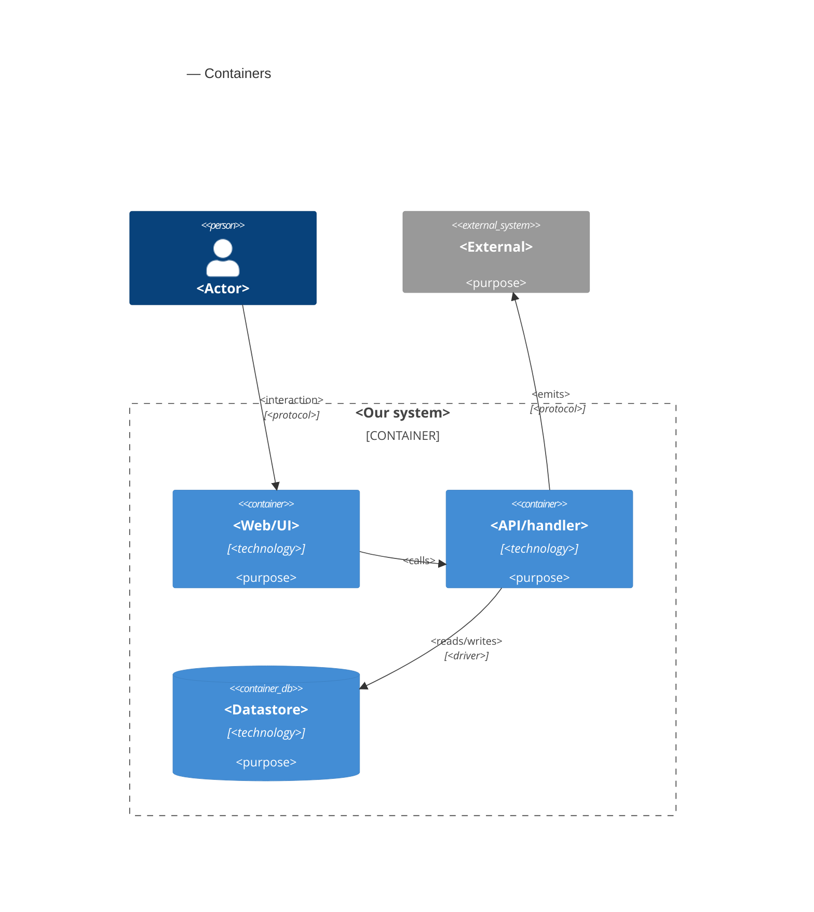

# Software Architecture Document — image-resize-convert

## 1. Introduction and goals

**Intent.** Give Власник картинки a local, single-page workflow to select an Оригінал, optionally inspect its local Preview, apply independently optional Максимальні розміри, choose JPEG, PNG or WebP, and receive one automatic download of the Результат followed by a clean form. The canonical requirements are [spec.md](./spec.md), including its automatic-download amendment, and [ux-flows.md](./ux-flows.md).

**Top-3 quality goals:**

1. Correct transformations: preserve the whole oriented image, fit supplied bounds without enlargement, and produce the agreed format, transparency and color behavior.
2. Transient private resources: upload only on submission, retain no server image for retrieval, and release each resource at its operation or browser-handoff boundary.
3. Accessible, recoverable interaction: one active operation, truthful busy state, retained input after recoverable failure, and automatic download followed by reset.

**Stakeholders.**

| Role | Interest | Sign-off owner? |
|---|---|---|
| Власник картинки | Correct downloaded images and an accessible local workflow | Yes, product and manual contrast acceptance |
| Tech Lead | Architecture, HEIC feasibility and resource ownership | Yes |
| Security Lead | Untrusted decoding and temporary-resource handling | Yes, before implementation acceptance |

**Decision override:** Use four feature ADRs rather than the skill's M-size guideline of 5–12. The project owner explicitly approved four substantive records with references to existing foundation decisions, avoiding duplicate stack, SPA and storage ADRs.

The owner approved depth medium, size M and route standard. Documents remain English, matching this feature folder; the canonical domain terms remain unchanged. Approval of architectural choices does not claim that the outstanding runtime checks in §11 have passed.

## 2. Constraints

**Technical.** Reuse Python 3.14 (mise pins 3.14.6), FastAPI 0.141.1, Starlette 1.6.0, Uvicorn 0.52.4 and Pillow 12.3.0 from the existing foundation and Python lockfile. Reuse React, Vite, TypeScript and Tailwind with the existing npm lockfile; no frontend framework migration is part of this feature. The application has no datastore, queue or result repository.

**Organisational.** This is the project owner's local tool. No deadline, effort budget, public launch, throughput target or latency measurement is required. The owner runs setup. Tech Lead resolves the design feasibility gates before tasks; Security Lead reviews the introduced decoding boundary before implementation acceptance.

**Conventions.** Follow [AGENTS.md](../../../AGENTS.md), the [architecture map](../../architecture-map.md) and [foundation ADRs](../../adr/). HTTP validation belongs in `backend/main.py`; ordinary image functions belong in `backend/images.py` when implemented. React uses local state, native accessible controls, relative API fetches and theme tokens in `frontend/src/index.css`. Preserve API 404s and backend startup before the first frontend build. Use root mise tasks and existing uv, npm and Bundler lockfiles.

**Privacy / external constraints.** Images are confidential. Inputs permit at most 20,000,000 bytes and 40,000,000 decoded pixels of the selected static image, with equality allowed. Preserve the agreed transient lifecycle and omit identifying image metadata and image content from logs. Accounts, persistent retrieval, animation output, public deployment, analytics and performance benchmarks are outside this feature. No additional regulatory regime is asserted.

The HEIC plugin and multipart package are planned implementation dependencies, not changes made by this documentation stage. Their absence from the current environment is not permission to omit HEIC or replace request-scoped UploadFile storage.

## 3. Context and scope

Власник картинки selects one Оригінал and receives a transformed Результат through the local Image compressor. Preview is prepared in the browser and is optional; selection and parameter edits never upload a file. The server treats uploaded content and parameters as untrusted, independently of browser validation.

The [architecture map](../../architecture-map.md) remains the brownfield source: its materialized foundation is commit `1837854`; inspection through `81326d5` found only documentation and convention changes after that scaffold. The implementation still contains a React shell and health/static-serving endpoints, without image processing. No repository re-scan or new architecture-map artifact is needed.

| Actor or system | Type | Interaction |
|---|---|---|
| Власник картинки | Person | Selects an Оригінал, requests processing and receives a Результат |
| Native browser facilities | Client platform | Optional local image display, file selection and download handoff |
| External application services | None | No third-party processing, identity provider or remote storage |

**Trust boundary.** Browser restrictions are usability controls. The Application enforces file presence, supplied parameters, actual file bytes, supported content, animation rules and decoded pixel limits. A result belongs only to its active response; there is no lookup capability that could expose another operation.

**C4 Context (L1):**



The owner confirmed this context in prose: one local application and no external application services.

## 4. Solution strategy

1. **Extend the existing web and backend surfaces.** Declare `target_surfaces: [web-frontend, backend-service]`. The web surface is the existing React SPA with local state, no client router and native controls. The backend surface is the existing FastAPI application. These are logical C4 containers, not two deployed services. Reuse existing theme tokens and reduced-motion behavior. [ADR 0001](./adr/0001-extend-web-frontend-and-backend-service.md) records the surface contract and inherits [foundation ADR 0002](../../adr/0002-single-service-and-kamal.md).

2. **Use one Pillow processing pipeline with a HEIC plugin.** Plan `pillow-heif` as the Pillow plugin, retaining normal Pillow handling for JPEG, PNG and WebP. Select only the designated HEIC primary static image. A HEIC collection is not rejected merely because the plugin reports multiple frames; actual animation remains rejected. Disable unneeded thumbnail, depth and auxiliary-image processing without discarding primary-image transparency. Normalize visible orientation exactly once before applying bounds. [ADR 0002](./adr/0002-load-heic-through-pillow-plugin.md) records this choice over a separate direct HEIC loader.

3. **Preserve compatible color interpretation.** Keep a compatible color profile rather than converting every image to sRGB. When the pixel color model changes, perform the required color transformation with Pillow ImageCms and retain only a profile matching the resulting pixels. Never relabel transformed pixels with an incompatible source profile. HEIC NCLX-only color information and PNG color information without ICC require the feasibility evidence in §11; silently discarding that information is not the chosen policy. Remove GPS, camera, EXIF, XMP and textual service metadata after orientation has been applied. JPEG composites transparency onto white; PNG and WebP retain it. [ADR 0003](./adr/0003-preserve-compatible-color-profiles.md) records this choice.

4. **Return the result within the submitted operation.** Send one processing request and receive its complete binary result. The browser uses a Blob URL and an automatic download action only for the current pending operation. Clear the form after handoff while keeping download cleanup independent of form state. Failure retains the current input for retry; obsolete completions never download or restore state. Server work remains request-scoped without jobs or retrieval IDs. [ADR 0004](./adr/0004-return-results-within-the-current-operation.md) defines ownership and the outstanding handoff proof.

The form defaults to JPEG on every selection and reset. Either dimension is optional. A supplied format counts as a transformation parameter; supplied dimensions with omitted format use JPEG, while omission of all parameters remains an error. Encoding adds no quality control or smaller-file guarantee. The processing contract's paths, field names, error schema and status codes belong to `sdd:api`, not this architectural decision.

## 5. Building block view

<!-- 🎯 Why: INTERNAL DECOMPOSITION — modules, containers, datastores. The static topology: who
     may talk to whom. Without §5, §6 (the flows) has no vocabulary of participants.
     📋 Write: 1 ¶ on the style (layered / hexagonal / clean / event-driven) + a folder tree + a
     C4Container block.
     📌 Draw ONE Container per declared `target_surface` (frontmatter): a fullstack
     [backend-service, web-frontend] = a backend-API container + a web/SPA container; a
     [backend-service, mobile-app] = the API + the mobile app. The Container(web, …) line below is
     just one surface's container — swap/add per what was declared in §4. → _shared/surfaces.md
     📌 e.g. «web app, content API, media worker, datastore, object store, CDN». -->

<One paragraph: layered / hexagonal / clean / event-driven, and why.>

**Internal decomposition:**

```
<e.g. modules/<feature>/>
├── domain/       <entities + sentinel errors>
├── app/          <use cases / services>
├── infra/        <repository + integration impl>
├── ports/        <handlers, DTOs, error mapping>
└── wiring        <self-wiring entry point>
```

**C4 Container (L2):** <!-- syntax → references/c4-mermaid-syntax.md. Real names, no <placeholder> stubs. ONE Container per declared target_surface (frontmatter); the web container below is one example surface. -->



## 6. Runtime view

<!-- 🎯 Why: the RUNTIME FLOW of 1–2 critical scenarios — who talks to whom, when, in what order.
     Without §6, §5 is just boxes with no life.
     📋 Write: a Mermaid sequenceDiagram. Participants are names from §5 (don't invent new ones).
     Messages are semantic («saves a draft»), NO HTTP verbs / paths / status codes — endpoint-level
     sequences arrive at the `api` stage.
     📌 e.g. «author → web: composes draft → web → content API: save». Seed the primary flow(s) here;
     the `sequences` stage then covers every §5 AC (no cap). Never N/A for M+; XS/S keeps ≥1 happy-path flow. -->

**Critical flow 1: <flow name>**

```mermaid
sequenceDiagram
    actor Actor
    participant Web
    participant Service
    participant Store
    Actor->>Web: <action>
    Web->>Service: <call>
    Service->>Store: <write>
    Store-->>Service: ok
    Service-->>Web: result
    Web-->>Actor: confirmation
```

**Critical flow 2: <e.g. async event propagation>** — <if applicable, otherwise N/A>.

## 7. Deployment view

<!-- 🎯 Why: the TOPOLOGY DevOps must know without reading the deploy charts — how many replicas,
     where the background worker lives, AT WHAT NUMBERS we scale.
     📋 Write: 2–3 sentences on topology + monitoring + concrete threshold numbers.
     📌 e.g. «500 authors → partition by quarter» (not «we'll think about scale later»).
     🎯 N/A allowed for XS/S that reuses an existing deployment unit with no change.
     Deployment-diagram scaffold → templates/deployment.md. -->

<Topology in 2–3 sentences. Where it runs, replicas, scaling thresholds.>

**Monitoring:**
- <Metrics — e.g. `<metric_name>`>
- <Alerts — e.g. «worker lag > 10 min → page on-call»>
- <Tracing — e.g. spans on the request boundary>

**Scaling thresholds:**
- <e.g. comfortable in one table up to N rows/year>
- <e.g. partition by quarter above N rows/year>

<!-- For XS/S with no deployment change: <!-- N/A: reuses existing deployment unit, no infra change --> -->

## 8. Crosscutting concepts

<!-- 🎯 Why: CROSS-CUTTING PATTERNS spanning several modules: logging, errors, authorization, ID
     strategy, events, caching. ⭐ The second-densest section. A pattern inside one module is NOT
     here; a project-wide convention belongs in the convention file.
     📋 Write: a table — concept / convention / where defined. One row per concept.
     📌 e.g. «sortable time-based IDs generated in the app layer» as a default from the convention file. -->

| Concept | Convention | Where defined |
|---|---|---|
| Logging | <e.g. structured, fields `module=<name>`> | <convention file §X or here> |
| Authentication | <e.g. token-based via middleware> | <convention file §X> |
| Error handling | <e.g. domain sentinel → ports error mapping → JSON> | <convention file §X> |
| ID strategy | <e.g. sortable time-based ID in the app layer> | <convention file §X> |
| Internationalisation | <e.g. N/A, single language> | — |
| Observability | <e.g. tracing on the request boundary> | — |
| Events | <module-specific patterns, if any> | <here> |

## 9. Architecture decisions

<!-- 🎯 Why: the REVERSE INDEX onto the adr/ folder. `ls adr/` gives the files; §9 gives the
     semantics — why they exist, which SAD section they attach to, what status.
     📋 Write: a 4-column table, one row per ADR. Mixed status is fine.
     📌 e.g. «0001 | Store content as a table of typed blocks | Accepted | §4». -->

| # | Title | Status | Section |
|---|---|---|---|
| <NNNN> | <imperative — e.g. "Use a sliding-window counter for rate limiting"> | Accepted | §<N> |
| <NNNN> | <imperative — e.g. "Co-locate the worker in the API process"> | Accepted | §<N> |

ADR files live under `docs/features/<slug>/adr/NNNN-<title>.md`.

## 10. Quality requirements

<!-- 🎯 Why: the QUALITY TREE — take a goal from §1 and break it into concrete leaves: tests,
     metrics, configs, drills. ⭐ Without §10, §1 is a manifesto. With §10 each declaration maps
     to something PROVABLE.
     📋 Write: per §1 goal — When / Then / How-verify. Numbers from spec §6 NFR VERBATIM (don't
     round ≤250ms to ≤300ms — that's a critic F6 hit).
     📌 e.g. «p95 ≤ 500 ms on a block update, verified by a 100 req/s load test». -->

Each top-3 goal from §1 expanded into a full scenario:

**QG-1. <quality attribute>**
- **When:** <trigger condition>
- **Then:** <expected behaviour with numbers from spec §6 NFR>
- **How verify:** <test / chaos drill / load test / metric>

**QG-2. <quality attribute>**
- **When:** <trigger>
- **Then:** <expected>
- **How verify:** <how>

**QG-3. <quality attribute>**
- **When:** <trigger>
- **Then:** <expected>
- **How verify:** <how>

## 11. Risks and technical debt

<!-- 🎯 Why: ⭐ collects EVERYTHING that can break — not only the technical. Without §11 risks get
     discussed at standups and lost; debt lives only in the head of whoever accepted it.
     📋 Write: a risk/debt table — severity — mitigation — owner. Accepted debt in its own block.
     📌 The first risk is often a product risk, not a technical one. That's normal. -->

<!-- Severity literals: Low / Medium / High for regular risks; "Open question" for rows created by
     a Save-as-OQ resolution during the Socratic walk (see references/socratic.md). -->

| Risk / debt | Severity | Mitigation | Owner |
|---|---|---|---|
| <e.g. Worker lag may reach hours during a downstream outage> | Medium | <alert >10 min, on-call playbook, retry backoff> | <DevOps> |
| <e.g. No event-schema versioning in v1> | Medium | <ADR-NNNN planned for v2, tolerate unknown fields> | <Backend> |
| Open architectural decision: <decision-headline> | Open question | Resolve before <stage trigger or YYYY-MM-DD>; <inline rationale from the Save-as-OQ> | <owner> |

**Accepted debt (acceptable in v1, plan to fix later):**
- <e.g. the entity is immutable / unversioned — OK for v1, may need audit versioning in v2>

## 12. Glossary

<!-- 🎯 Why: ⭐ the DOMAIN GLOSSARY that ends arguments a year later («checkpoint — weekly or
     biweekly? quarter — calendar or fiscal?»).
     📋 Write: a term / meaning table. Business + technical terms mixed.
     📌 e.g. «Lesson | a unit inside a course made of blocks (text, video)». -->

| Term | Meaning |
|---|---|
| <e.g. domain object A> | <its meaning in this domain> |
| <e.g. domain object B> | <its meaning> |
| <e.g. domain invariant name> | <the rule, in plain language> |
