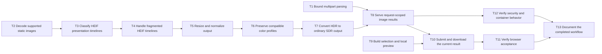

# Epic — image-resize-convert

> **Spec:** [spec.md](../spec.md) · **Design:** [sad.md](../sad.md) · **Data model:** [data-model.md](../data-model.md) · **API:** [openapi.yaml](../contracts/openapi.yaml) · **ADRs:** [adr/](../adr/)

## Goal

Deliver one local selection-to-resize/convert-to-automatic-download flow, followed by a clean form. Preserve the whole oriented image, compatible colors and confidential request-scoped resources.

Size M, route standard, artifact language English. The owner approved this 13-task breakdown. The bare foundation has no processing endpoint. Both pre-tasks gates are closed by SAD §11 and the dated feasibility audit; older notes in screens/data-model are stale, not new gates.

## Scope

- **In:** ordinary Pillow functions, bounded HTTP parsing and binary response, SCR-01 native React form, focused tests, browser/security acceptance and accurate usage documentation.
- **Out:** database/migrations, history, accounts, batch/cropping/enlargement, file-size targeting, quality controls, new browser test infrastructure, public deployment, tracker export and Android acceptance (owner-deferred).

## Task map

Logical waves describe prerequisite readiness, not concurrent edit permission. `files_hint` overlap serializes T1/T2 (manifests and initialization), T2–T7 (image implementation/tests), T8/T12 (API tests), and T9/T10 (UI). T9 can run alongside backend work. T11 and T12 have independent evidence files and can run in parallel after their prerequisites. No standalone shared TypeScript contract or compile-broken intermediate change is planned. T1–T7 stay internal until T8 exposes the complete route.

## Tasks

See [tracker.md](./tracker.md) for status. Machine contract: [tasks.json](../tasks.json). Every task includes its own concrete check; shared ACs describe complementary slices, not repeated whole-feature delivery.

| # | Task | Layer | Blocked by | DoD (short) |
|---|---|---|---|---|
| T1 | [Bound multipart parsing](./bound-multipart-parsing.md) | ports | — | Parser and parameter regressions in tests/test_images_api.py pass, including exact 20,000,000 file bytes and closed partial handles after EOF/disconnection; documented transport bounds match implementation. |
| T2 | [Decode supported static images](./decode-supported-static-images.md) | domain | — | tests/test_images.py decoding regressions pass for all four input formats, non-first HEIC primary and pre/post-decode pixel boundaries; decoding exceptions release every owned image. |
| T3 | [Classify HEIF presentation timelines](./classify-heif-presentation-timelines.md) | domain | T2 | HEIF non-fragmented timing regressions in tests/test_images.py pass for real sequences and static edit/composition controls, without using image count or brands as the classification oracle. |
| T4 | [Handle fragmented HEIF timelines](./handle-fragmented-heif-timelines.md) | domain | T3 | tests/test_images.py fragmented/edit/composition and decodable-gallery checks pass on macOS and Linux; no production NEEDS_TIMELINE fallback remains. |
| T5 | [Resize and normalize output](./resize-and-normalize-output.md) | domain | T4 | tests/test_images.py geometry/format regressions pass for the exact AC-04/05 examples, no enlargement, all 12 input/output combinations, alpha handling and service-metadata removal; color completion remains explicitly assigned to T6/T7. |
| T6 | [Preserve compatible color profiles](./preserve-compatible-color-profiles.md) | domain | T5 | tests/test_images.py SDR color checks pass on macOS and Linux for compatible ICC, pixel-model conversions, NCLX-only and PNG gAMA/cHRM sources; emitted profiles match output pixels while identifying metadata is absent. |
| T7 | [Convert HDR to ordinary SDR output](./convert-hdr-to-ordinary-sdr-output.md) | domain | T6 | tests/test_images.py HDR controls pass on macOS/Linux: real HLG and independent HLG/PQ anchors produce ordinary 8-bit output with matching color profiles, primary-image semantics and resource cleanup. |
| T8 | [Serve request-scoped image results](./serve-request-scoped-image-results.md) | ports | T1, T7 | tests/test_images_api.py endpoint and ownership regressions pass, including actual socket interruption and raw cancellation, correct binary headers/errors, no retrieval capability and no leaked upload/image/response owners. |
| T9 | [Build selection and local preview](./build-selection-and-local-preview.md) | ui | — | Recorded SCR-01 selection checks pass for default/empty/ready/local-validation states, byte boundaries, reset/stale Preview, zero upload requests and native controls; frontend build and lint pass. |
| T10 | [Submit and download the current result](./submit-and-download-the-current-result.md) | ui | T8, T9 | Recorded SCR-01 loading/validation/error/success checks pass: one complete download per current operation, safe URL release, clean reset/focus, same-file reselection and retained-input retry without stale or duplicate downloads. |
| T11 | [Verify browser acceptance](./verify-browser-acceptance.md) | tests | T10 | The implemented-flow browser matrix in _audit/browser-acceptance.md passes on desktop Chrome/Safari/Firefox and iPhone Safari, including complete downloads, recovery/closure, both widths, keyboard/reduced motion and recorded owner contrast acceptance. |
| T12 | [Verify security and container behavior](./verify-security-and-container-behavior.md) | tests | T8 | Host feature tests, Linux image/color verification and live-container smoke pass; _audit/security-container-acceptance.md records closed ownership checks, confidential errors/logs and Security Lead acceptance. |
| T13 | [Document the completed workflow](./document-the-completed-workflow.md) | docs | T11, T12 | README.md and docs/architecture-map.md match the accepted browser/security/container evidence, their local links resolve, and the documented frontend build, pytest and both lint commands pass. |

## Risks / Hard rules

- Complete HEIF edit/composition/fragment timelines; NEEDS_TIMELINE is never a production fallback. Static galleries must remain accepted. Pin and verify version-sensitive Starlette and bundled LittleCMS mechanisms on macOS/Linux.
- Enforce inclusive 20,000,000-byte and 40,000,000-pixel limits; separately document bounded multipart representation/error mapping without a product maximum dimension. Worker ownership must survive raw cancellation; no image content, filenames or identifying metadata in logs.
- Preserve orientation, compatible color interpretation and alpha semantics. Do not copy feasibility probes wholesale or claim they prove full feature acceptance. No accepted shortcut exists.
- Use SCR-01 native controls and existing theme tokens. Safe immediate post-click URL release is backed by the dated audit; recheck the complete implemented flow on the agreed browsers, including iPhone Safari. Project owner contrast acceptance and Security Lead review remain required.
- Keep tasks within one day and preferably about 500 changed lines. If actual work/context exceeds the atomic slice, revise the task boundary before implementation instead of dropping required timeline/color/lifecycle cases.

— `sad.md §10–11, implementation acceptance and carry-forward, abridged` · [Full text](../sad.md)

### AC coverage

| AC | Tasks |
|---|---|
| AC-01 | T9, T11, T13 |
| AC-02 | T9, T11 |
| AC-03 | T9, T10, T11 |
| AC-04 | T5 |
| AC-05 | T5 |
| AC-06 | T5 |
| AC-07 | T2, T5, T8, T9, T12, T13 |
| AC-08 | T5, T9, T11 |
| AC-09 | T2, T5, T6, T7, T9, T12 |
| AC-10 | T2, T3, T4, T7, T9, T11, T12 |
| AC-11 | T1, T8, T9, T10, T12 |
| AC-12 | T1, T2, T3, T4, T8, T9, T12 |
| AC-13 | T8, T10, T11, T13 |
| AC-14 | T8, T10, T12 |
| AC-15 | T8, T10, T11, T13 |
| AC-16 | T1, T2, T8, T9, T10, T11, T12, T13 |

### Structural self-check — 2026-09-06

13/13 PASS, re-read from disk: JSON schema/layers; acyclic valid dependencies; inverse blocks; frontmatter/JSON parity; existing artifact pointers; nine non-empty template sections; complete AC coverage; verbatim AC matching; provenance/source matching; measured context bands; estimates/owners/DoD; parallel and overlap lanes; epic DAG and local-link parity. Verified 188 source quote blocks. Inline counts range from 43 to 89 non-empty lines; T1/T2/T6 carry justified L budgets for more than four implementation/config/test locations, and the remaining tasks are M.

`rtk proxy mmdc -i docs/features/image-resize-convert/tasks/_epic.md -o /tmp/image-resize-convert-task-check.md` exited 0 and rendered the single flowchart. Independent read-only review found no required corrections in task scope, source quotations, architecture carry-forward, UI/API coverage or incremental green commits. Application tests were not run: this stage changes only task documentation and makes no implementation-acceptance claim.

### Stage handoff

Review this directory and tasks.json after the structural self-check. Proposed commit: `tasks: image-resize-convert (breakdown + tasks.json)`. Route standard: `/clear`, then `/sdd:plan-tests image-resize-convert`. Since every DoD names its check, the owner may instead choose `/sdd:implement image-resize-convert`; no automatic skip. Do not run implementation as part of generating this breakdown.
