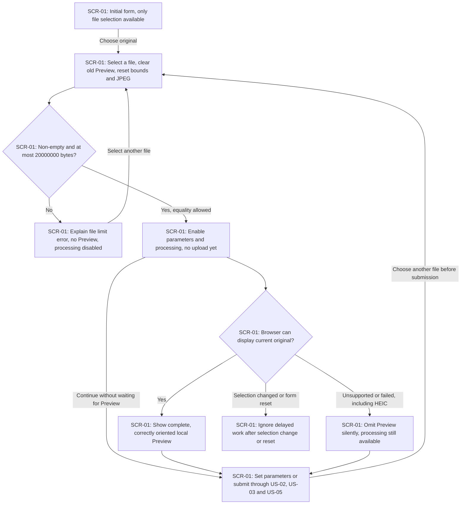
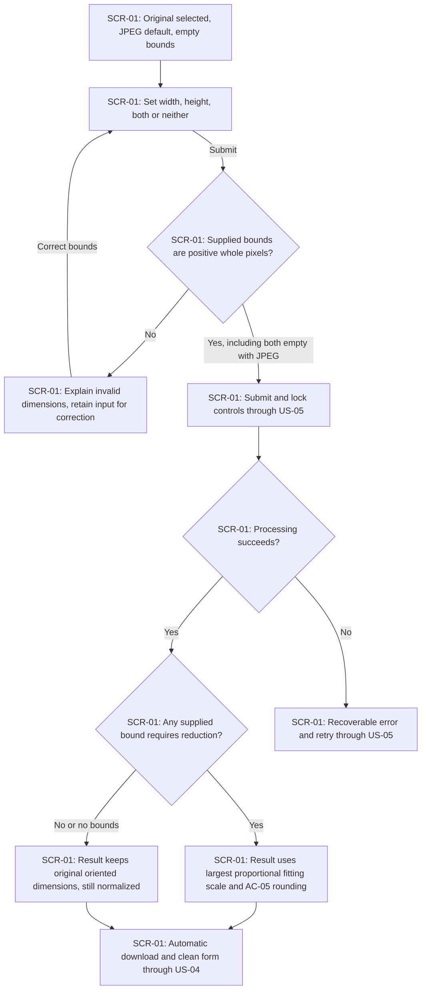
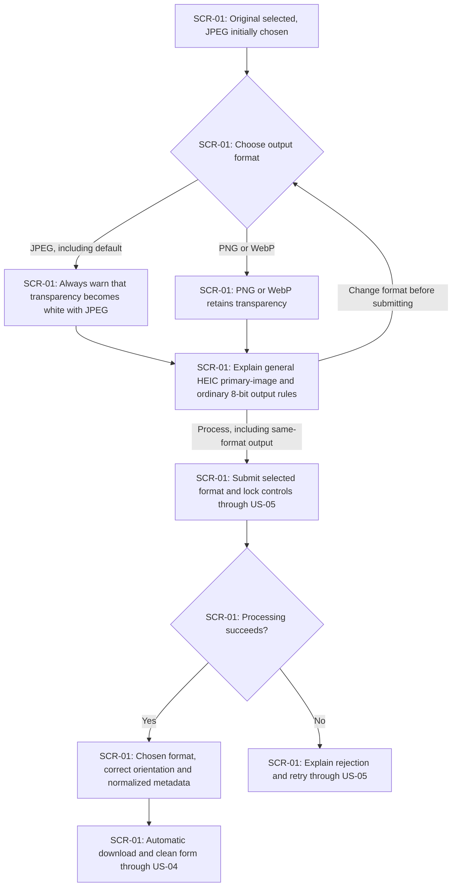
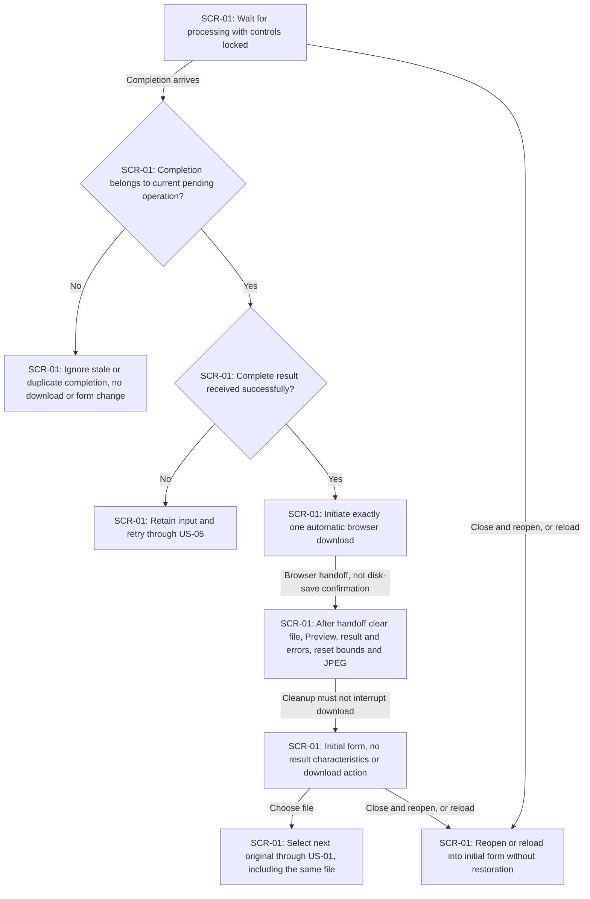
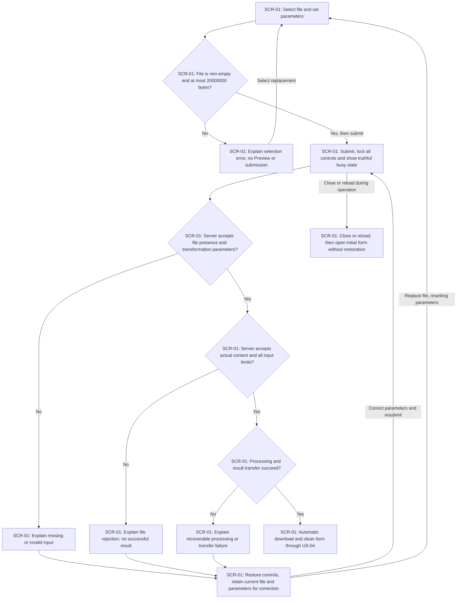

# UX flows — image-resize-convert

> Source: [spec.md](./spec.md), including the automatic-download UX amendment, and [CONTEXT.md](./CONTEXT.md). Route: standard. Depth: medium. The owner confirmed all five flows in prose and then confirmed automatic download with a clean form as the replacement success path. These flows feed design, sequences, screens and plan-tests.

## Platform decisions

- **Posture:** responsive-both — the owner confirmed equal support for phone and desktop, matching the spec's 360 and 1280 CSS-pixel checks. `docs/design-system.md` is absent; use code-mode assumptions and recommend `/sdd:design-system` at handoff.
- One page and one form, without a wizard, result page or confirmation dialog. All user stories take place on SCR-01; busy, error and clean-form outcomes are not separate screens. Browser-managed file selection and download are external actions, not application screens.
- Selection and Preview stay local. Preview is optional and never gates processing after the empty-file and byte-limit checks pass. Processing locks file selection, parameters and repeat submission; there is no cancel action or fabricated progress percentage.
- Success initiates one automatic download and resets the form after browser handoff, without a page reload or waiting for confirmation of saving to disk. No result characteristics, manual download action or history remain. Recoverable errors retain the file and parameters for retry.
- Preserve keyboard access, visible focus, readable contrast and the complete journey at both viewport widths. Reduced motion removes decorative motion without losing functionality. Design must verify download handoff and resource cleanup without reset interrupting the download; these flows do not choose that implementation or any API contract.

## Screen inventory

| ID | Screen | Purpose | Entry | Exit |
|---|---|---|---|---|
| SCR-01 | Image conversion | Select one original, set optional bounds and output format, submit, recover or receive an automatic download | Open or reload the application; return to the initial form after successful download handoff | Browser download while remaining on SCR-01; select the next original; close the page |

## Flows

All five §4 user stories touch UI; no backend-only story is omitted. Backend-only portions of mixed ACs are identified in the coverage notes rather than invented as user navigation. Cross-flow references below continue on SCR-01.

### Flow: US-01 — Select and inspect an image

The owner opens the initial form and chooses a file. Every new selection removes the old Preview and resets dimensions and format, even when the new file is invalid. Empty files and files above 20,000,000 bytes show an error without Preview or processing; exactly 20,000,000 bytes is allowed. Other files enable parameters and processing immediately, with JPEG selected and both limits empty. Preview displays the whole, correctly oriented image if the browser supports it; unsupported or failed Preview is silently omitted without blocking processing or showing a broken-image placeholder. The owner may continue without waiting for Preview. No file is uploaded until submission; server content checks occur in US-05. Delayed work after another selection or successful reset is ignored and cannot restore an old Preview, repopulate the form or initiate another download.

### Flow: US-02 — Set maximum dimensions

The owner can set either maximum dimension, both or neither; JPEG already supplies a transformation parameter. Non-positive or fractional dimensions cause a clear rejection and can be corrected without reselecting the file. Submission locks the controls; processing errors use US-05. Successful processing preserves the whole oriented image without enlargement. When reduction is necessary, use the largest proportional scale fitting all bounds, rounding each dimension to the nearest pixel with halves up and a minimum of one pixel. For 2400×1200, width 1200 produces 1200×600, height 300 produces 600×300 and both bounds produce 600×300. For 1000×333, width 500 produces 500×167. Ineffective bounds preserve dimensions while still producing normalized output. Both successful branches continue to automatic download and reset; result dimensions are properties of the downloaded file, not a result panel.

### Flow: US-03 — Choose the output format

JPEG is selected for every new original, including JPEG input. The owner may choose JPEG, PNG or WebP and may keep the input format. JPEG always shows the conditional transparency warning before submission, without detecting transparency first; PNG and WebP retain it. The form also explains general HEIC behavior before submission without server inspection: use only the designated primary static image, omit extra images and convert HDR to ordinary 8-bit output without promising the original HDR appearance. Processing supports static JPEG, PNG, WebP and HEIC inputs. Successful output has the chosen format and correct orientation, omits GPS, camera and textual metadata, and retains information required for correct color interpretation. It need not be smaller or byte-identical to the original. Success follows US-04; rejection follows US-05. Warnings and Preview availability never require a separate confirmation step.

### Flow: US-04 — Download the current result

Only the current pending operation may initiate a download. A stale or duplicate completion has no effect; a failed current operation preserves input for retry. A complete successful result initiates exactly one browser download with the requested output format and matching filename extension, leaving the original untouched. After handing the file to the browser, the page clears the selected file, Preview, result and errors, empties both bounds and resets JPEG without reloading. Only file selection is available until another eligible file is selected. No result characteristics or manual download action remain. Reset does not wait for confirmation of saving to disk and must not interrupt the initiated download; download resources are released when no longer required for handoff. The owner can select the next file, including the same file again. Reloading or reopening the page starts clean; the application offers no history, lookup, restoration or retrieval of a different operation's result. A failed later conversion never restores a previous result.

### Flow: US-05 — Recover from rejected processing

The form first rejects empty or oversized files without Preview or submission. Once submitted, file selection, transformation controls and repeat submission are disabled; the busy state has no fabricated percentages or cancel action. Server validation rejects missing files, missing transformation parameters, invalid dimensions and unsupported output choices, even when form restrictions are bypassed. Empty dimensions impose no bound; valid dimensions without a format produce JPEG, but omitting both dimensions and format is an error. Server file validation rejects empty, corrupted, unsupported or animated content, more than 20,000,000 bytes or more than 40,000,000 decoded pixels; exact limits pass. Actual content determines support, and additional HEIC images follow the primary-image rule rather than counting as animation. These checks describe rejection paths, not an implementation order for decoding. A recoverable validation, processing or transfer error restores controls and preserves current input for correction and retry; replacing the file follows US-01 and resets parameters. Success follows US-04. Closing or reloading interrupts the page journey without restoration; server operation resources are released on success, failure and interruption, with no retained image available for future retrieval.

## AC coverage

| AC | Shown by | Notes |
|---|---|---|
| AC-01 | US-01: S1_START, S1_BYTES, S1_ERROR, S1_READY | Empty and oversized selection rejected locally; equality allowed; JPEG and empty bounds enable submission without content validation. |
| AC-02 | US-01: S1_PREVIEW, S1_SHOW, S1_OMIT, S1_NEXT | Local, complete and correctly oriented Preview; absence, including HEIC, never blocks processing. |
| AC-03 | US-01: S1_SELECT, S1_STALE; US-04: S4_IGNORE, S4_RESET | New selection resets parameters even if invalid; stale work cannot restore Preview, repopulate the form or download again. |
| AC-04 | US-02: S2_EDIT, S2_SCALE | Width-only, height-only and combined limits; exact 2400×1200 examples in flow prose. Verify downloaded pixels, not displayed metrics. |
| AC-05 | US-02: S2_BOUNDS, S2_SCALE, S2_SAME | Whole oriented image, largest fitting scale, no enlargement, halves-up rounding and minimum one pixel; 500×167 example in prose. |
| AC-06 | US-02: S2_SAME; US-03: S3_SUBMIT, S3_OUTPUT | Ineffective limits and same-format output still produce normalized downloads. |
| AC-07 | US-03: S3_START, S3_FORMAT, S3_OUTPUT | Four supported static input formats and three output formats; default JPEG; no smaller-file or byte-identity promise. |
| AC-08 | US-03: S3_JPEG, S3_ALPHA | Conditional JPEG warning always appears before submission, including default; white background versus retained transparency. |
| AC-09 | US-01: S1_SHOW; US-02: S2_SCALE; US-03: S3_OUTPUT | Correct orientation in Preview and downloaded output. Metadata normalization is a downloaded-file property, not a separate screen. |
| AC-10 | US-03: S3_NOTICE, S3_OUTPUT; US-05: S5_CONTENT | General HEIC notice before submission; primary image, omitted extra images and ordinary 8-bit output without HDR fidelity promise. |
| AC-11 | US-02: S2_VALID, S2_ERROR; US-05: S5_PARAMETERS, S5_PARAM_ERROR, S5_RETRY | Explain missing or invalid parameters. Direct requests bypassing UI restrictions, including omitted-format fallback, require boundary tests; they are not extra UI controls. |
| AC-12 | US-01: S1_BYTES, S1_ERROR; US-05: S5_LOCAL, S5_CONTENT, S5_FILE_ERROR | Local byte checks; server content, animation, byte and pixel checks; exact limits allowed; primary-image exception explained in prose. Bypass enforcement needs boundary tests. |
| AC-13 | US-04: S4_DOWNLOAD, S4_RESET, S4_CLEAN, S4_NEXT | One automatic download with matching extension; original untouched; clean form after handoff; no result panel; same-file reselection supported. |
| AC-14 | US-04: S4_IGNORE, S4_CLEAN, S4_REOPEN | No history, lookup or result retrieval exists. Attempts to retrieve another operation's result are boundary checks, not a navigable application flow. |
| AC-15 | US-04: S4_CURRENT, S4_IGNORE, S4_RESET; US-05: S5_WAIT, S5_RETRY, S5_REOPEN | Lock all controls, truthful busy state, retained input on recoverable error, clean form after success and no restoration after closure. |
| AC-16 | US-01: S1_SELECT, S1_STALE; US-04: S4_RESET, S4_CLEAN; US-05: S5_RETRY, S5_REOPEN | Local Preview lifetime and safe download handoff cleanup; server cleanup on success, failure and interruption is a lifecycle test, not a screen. |

The downstream test plan must exercise two consecutive conversions, including same-file reselection, one download per success, clean-form reset without interrupting that download, retained input on recoverable failure and stale completion suppression. Run the complete UI journey at both specified widths, with keyboard access and reduced motion. Downloaded-file checks cover dimensions, format, orientation, transparency and metadata; no UI metric panel is required.
