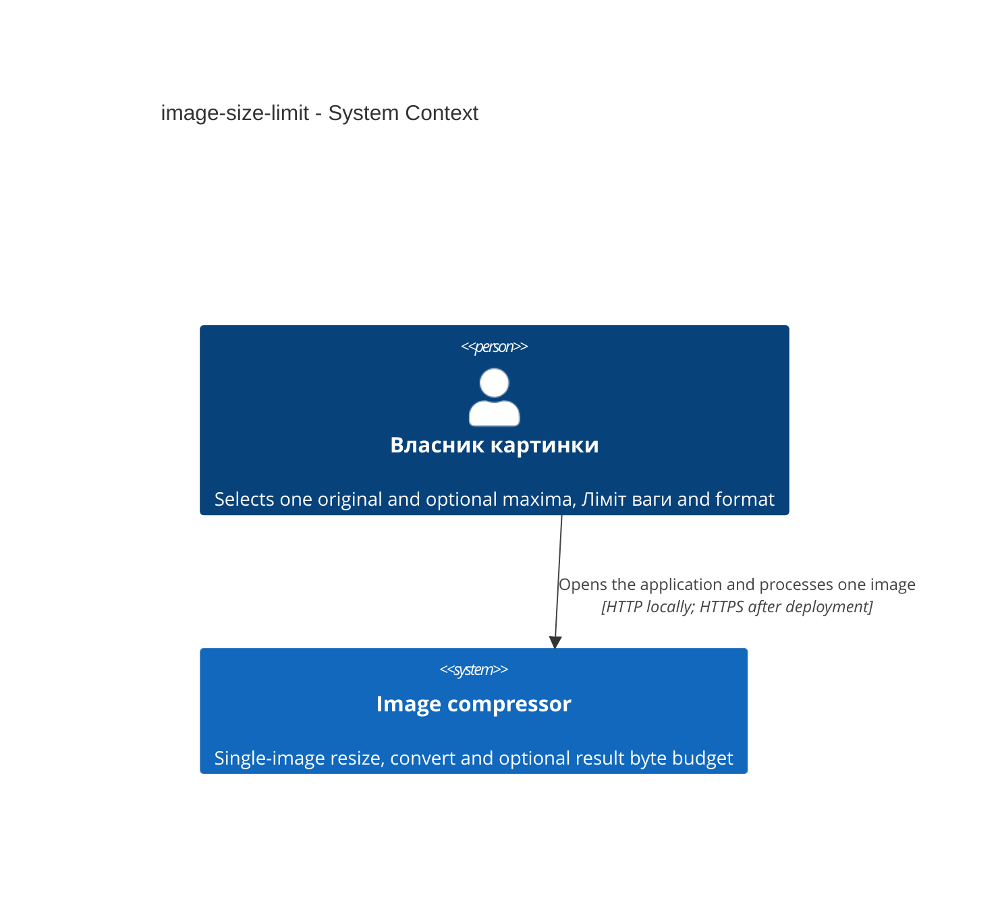
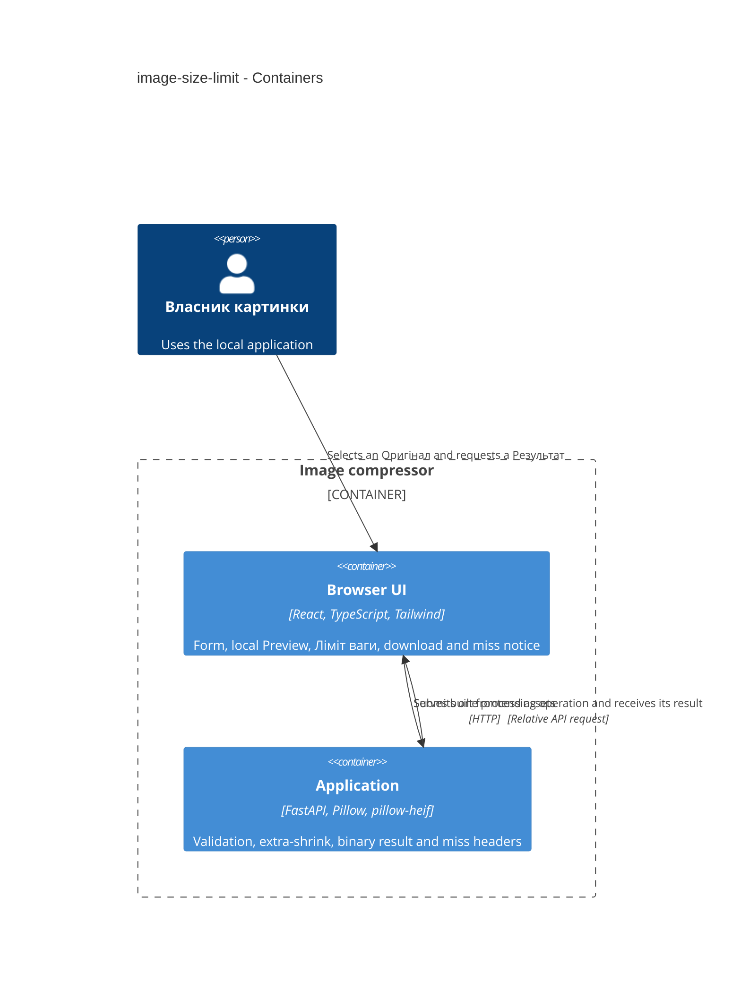
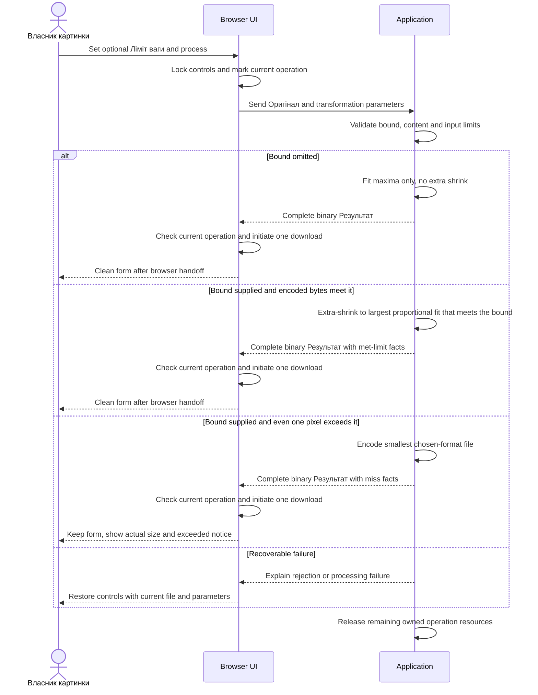

# Software Architecture Document — image-size-limit

**Design review — 2026-09-12.** All twelve sections were approved through the easy-depth design walk (route quick, size S). An independent clean-context critic reviewed the written SAD and two ADRs and returned `NO_CONTESTED_DECISIONS`. All three Mermaid blocks rendered with `mmdc`. Structural checks confirmed the section count, declared surfaces, Accepted ADRs, closed ADR index and absence of template placeholders. NFR targets in §10 match spec §6 verbatim.

## 1. Introduction and goals

**Intent.** Let Власник картинки apply an independently optional Ліміт ваги on the existing one-form workflow. When the bound is attainable, produce the largest proportional Результат that still fits. When it is not, still produce the smallest chosen-format file, start one automatic download, keep the form, and show the actual size plus that the bound was exceeded. Canonical requirements: [spec.md](./spec.md) and [ux-flows.md](./ux-flows.md).

**Top-3 quality goals (1-liners; full scenarios in §10):**

1. Bound arithmetic: 1 Mb = 1,048,576 bytes and 1 Kb = 1,024 bytes, compared after encoding in whole bytes.
2. Miss visibility: after an over-limit Результат, actual size and the exceeded notice remain until the next process, a new file selection or page close.
3. Accessible Ліміт ваги: keyboard-usable number and unit, visible focus, and a complete flow at 360 and 1280 CSS pixels with no horizontal page overflow.

**Stakeholders.**

| Role | Interest | Sign-off owner? |
|---|---|---|
| Власник картинки | Optional result byte budget, retryable miss, accessible form | Yes, product and manual contrast acceptance |
| Tech Lead | SAD approval, miss-header contract, extra-shrink in image functions | Yes |
| Security Lead | Residual risk only; no new authz boundary | Yes, residual review if decoding or resource ownership changes |

The owner approved depth easy, size S and route quick. Documents remain English, matching this feature folder. Domain terms follow [CONTEXT.md](./CONTEXT.md).

## 2. Constraints

**Technical.** Reuse Python 3.14, FastAPI, Uvicorn, Pillow 12.3.0 and pillow-heif 1.6.0 from the foundation and Python lockfile. Reuse React, Vite, TypeScript and Tailwind with the existing npm lockfile. HTTP validation belongs in `backend/main.py`; extra-shrink and encoding belong in `backend/images.py`. Uploads stay request-scoped. Input limits stay at most 20,000,000 bytes and 40,000,000 decoded pixels of the selected static image, equality allowed. Ліміт ваги is not an upload cap. No datastore, queue, result ID or retrieval.

**Organisational.** Size S, about one week. No launch deadline, public-hosting requirement, throughput target or latency measurement. The owner runs setup. Tech Lead owns this SAD.

**Conventions.** Follow [AGENTS.md](../../../AGENTS.md), the [architecture map](../../architecture-map.md) and [foundation ADRs](../../adr/). React uses local state, native accessible controls, relative `/api` fetches and theme tokens in `frontend/src/index.css`. Preserve API 404s and backend startup before the first frontend build. Use root mise tasks and existing uv, npm and Bundler lockfiles. Extend `POST /api/v1/images/process` rather than adding an endpoint.

**Privacy / external constraints.** Originals are confidential. No accounts, identity fields or lookup. AuthZ/AuthN impact is none. Security review is N/A for this increment: no new authz boundary and no new PII (spec §6.1). Residual risk is owner-induced long encoding search and misread units. No additional regulatory regime is asserted.

## 3. Context and scope

Власник картинки already resizes and converts one Оригінал on a local single page. This increment adds Ліміт ваги to that same form. Preview remains frontend-only. The server treats uploaded content and parameters as untrusted.

<!-- brownfield: architecture map reflects 86ac0c5 (image-resize-convert shipped); HEAD af40862 is the survey commit. Module layout, layering and datastores are unchanged. -->

**External systems (in / out):**

| Actor or system | Type | Interaction |
|---|---|---|
| Власник картинки | Person | Selects an Оригінал, sets optional maxima, Ліміт ваги and format, receives a Результат |
| Native browser facilities | Client platform | File selection, optional Preview, download handoff |
| External application services | None | No third-party processing, identity provider or remote storage |

**Trust boundary.** Browser checks are usability controls. The Application enforces file presence, supplied parameters, Ліміт ваги arithmetic, actual file bytes, supported content and decoded pixel limits. A result belongs only to its active response. There is no lookup that could expose another operation.

**C4 Context (L1):**

One local application. No external application services.

## 4. Solution strategy

1. **Extend the existing process surfaces.** Declare `target_surfaces: [backend-service, web-frontend]`. The web surface is the existing React SPA with local state, no client router and native controls. Ліміт ваги extends the current parameter fieldset on SCR-01; there is no second screen. The backend surface is the existing FastAPI application. These are logical C4 containers, not two deployed services. [ADR 0001](./adr/0001-extend-existing-process-surfaces.md) records the surface contract and inherits [foundation ADR 0002](../../adr/0002-single-service-and-kamal.md).

2. **Keep the existing SPA delivery.** UI architecture stays the current client-rendered React page, React local state, relative fetch and no router. This does not cross the ADR gate: [foundation ADR 0002](../../adr/0002-single-service-and-kamal.md) already forbids a separate production frontend server and a client-side router for a single page.

3. **Apply bound-driven extra shrink in image functions.** Empty Ліміт ваги keeps the current geometry rule in `output_size`: largest proportional fit to supplied maxima, no extra reduction. A supplied bound is the primary constraint: after that ceiling, `backend/images.py` may reduce pixels below maxima and below the Оригінал, without cropping, stretching, enlargement or a silent format change, and stop at the largest proportional size and highest encoding quality that already meets the bound. One pixel and the smallest file of the chosen format that still exceed the bound are a miss, not a rejection without a file. The exact search procedure is task-level provided AC-05 holds.

4. **Signal a miss on the binary response.** Keep the complete binary Результат and attachment filename. When a bound was supplied, also send miss facts on the response so the Browser UI can start one download and then either reset (met) or keep the form (miss). Do not use a client-error status for an unattainable bound. Do not wrap the file in JSON or multipart metadata. [ADR 0002](./adr/0002-signal-size-limit-miss-with-headers.md) records this choice.

A supplied Ліміт ваги counts as a transformation parameter, including with only the initial JPEG and no maxima. Invalid zero, negative or non-positive values are rejected with no Результат and the Оригінал kept. Paths, error schema and status codes belong to `sdd:api`.

## 5. Building block view

Reuse the existing split: browser form, HTTP boundary, ordinary image functions. No new package, repository, worker or datastore. The backend calls image functions directly.

| Location | Responsibility |
|---|---|
| `frontend/src/App.tsx` | SCR-01, Ліміт ваги number and unit, current operation, download, miss notice, reset |
| `frontend/src/index.css` | Existing theme tokens and reduced-motion rules |
| `backend/main.py` | Multipart validation including Ліміт ваги, byte conversion, response headers, resource ownership |
| `backend/images.py` | Existing decode/orient/encode plus extra-shrink search when a bound is supplied |
| `tests/` | Existing smoke coverage plus specified bound, miss and geometry behavior |

Native encoding must not block the asynchronous HTTP event loop. At most one submitted processing operation; file selection and all transformation controls including Ліміт ваги are disabled while processing.

**C4 Container (L2):**

Development uses the existing Vite proxy. The built application serves frontend assets directly. No ContainerDb.

## 6. Runtime view

**Critical flow: process with optional Ліміт ваги, then met-limit reset or miss keep-form.**

`sdd:sequences` expands this seed to every spec §5 acceptance criterion.

## 7. Deployment view

<!-- N/A: reuses existing deployment unit, no infra change -->

Same multi-stage Docker image and Uvicorn process as the shipped foundation. No new replica, worker, volume or health path.

## 8. Crosscutting concepts

| Concept | Convention | Where defined |
|---|---|---|
| Logging | No image bytes, original filenames or identifying metadata | Foundation ADR 0003, architecture map |
| Authentication | None; local owner-operated application | spec §6.1 |
| Error handling | Manual HTTP-boundary validation, safe FastAPI errors | `backend/main.py`, foundation ADR 0002 |
| ID strategy | N/A — no stored entities or result IDs | Foundation ADR 0003 |
| Internationalisation | N/A, single language | — |
| Observability | Stdout/stderr only; no latency KPI | spec §6 |
| Events | N/A — synchronous in-process call | §4, §5 |
| Bound transport | Optional multipart fields `size_limit` (positive decimal) and `size_unit` (`mb` or `kb`); empty omits the bound; server converts with 1 Mb = 1,048,576 and 1 Kb = 1,024 | This section, ADR 0002 |
| Miss facts | When a bound was supplied, response headers `X-Result-Bytes` (whole encoded bytes) and `X-Size-Limit-Met` (`true` or `false`); omit both when the bound is omitted | This section, ADR 0002 |
| Current operation | One AbortController; stale completions never download or restore miss facts | Existing Browser UI, spec AC-10 and AC-11 |

## 9. Architecture decisions

| # | Title | Status | Section |
|---|---|---|---|
| 0001 | Extend existing process surfaces | Accepted | §4 |
| 0002 | Signal size-limit miss with headers | Accepted | §4 |

ADR files live under `docs/features/image-size-limit/adr/`.

## 10. Quality requirements

Each top-3 goal from §1 expanded into a full scenario. Numbers are from spec §6 NFR verbatim.

**QG-1. Bound arithmetic**
- **When:** Власник картинки supplies Ліміт ваги and processing encodes a Результат
- **Then:** the bound in bytes equals the entered number multiplied by 1,048,576 for Mb or by 1,024 for Kb; comparison uses whole bytes of the encoded Результат; 0.5 Mb equals 524,288 bytes; 200 Kb equals 204,800 bytes
- **How verify:** fixture tests for those two conversions and whole-byte comparison after encoding

**QG-2. Miss visibility**
- **When:** an over-limit Результат is produced
- **Then:** actual size and the exceeded notice remain until the next process, a new file selection or page close
- **How verify:** browser check of the kept form

**QG-3. Accessible, responsive Ліміт ваги**
- **When:** Власник картинки uses the Ліміт ваги number and unit
- **Then:** every interactive control including that number and unit is keyboard-usable with visible focus; labels, errors and the exceeded notice pass the project owner's manual readable-contrast review; reduced motion as on the existing form; complete flow at viewport widths 360 and 1280 CSS pixels with no horizontal page overflow, including the unit choice beside the number
- **How verify:** keyboard flow, visible-focus review, owner contrast acceptance, reduced-motion check, browser visual review at both widths

Preserve existing input limits (at most 20,000,000 bytes and 40,000,000 decoded pixels) and form concurrency (at most one submitted processing operation; controls including Ліміт ваги disabled while processing). Performance latency, throughput and public-service uptime are N/A per spec §6.

## 11. Risks and technical debt

| Risk / debt | Severity | Mitigation | Owner |
|---|---|---|---|
| A tight bound on a large original can hold the only screen in a busy state with no cancel | Medium | Keep a truthful busy state without fabricated percentages; cancel remains a non-goal | Project owner |
| Mb/Kb labels with binary multipliers can be read as decimal megabytes used by mail hosts | Low | Keep the labels Mb and Kb; pin 0.5 Mb = 524,288 bytes and 200 Kb = 204,800 bytes in tests | Tech Lead |
| A one-pixel or lowest-quality file that still meets the bound follows the success reset and can be used as if it were a useful result | Low | Specified success path; no extra warning this increment | Project owner |
| A future reverse proxy may strip custom miss headers | Low | Same-origin today; if headers are missing, compare `blob.size` to the bound | Tech Lead |

**Accepted debt (acceptable in v1, plan to fix later):**
- Extra-shrink search procedure is not locked. The implementer chooses the search in `backend/images.py` as long as AC-05 holds (largest proportional size and highest encoding quality that already meets the bound; nearest-pixel rounding, halves up, minimum one pixel).

## 12. Glossary

| Term | Meaning |
|---|---|
| Власник картинки | The person processing their selected image. NOT an application account or permission role. |
| Ліміт ваги | Independently optional upper bound on Результат file size, entered as a positive float with unit Mb (default) or Kb (1 Mb = 1,048,576 bytes, 1 Kb = 1,024 bytes). NOT the 20,000,000-byte upload cap on Оригінал. |
| Максимальні розміри | Independently optional upper width and height bounds in pixels. NOT exact dimensions, cropping or stretching. |
| Оригінал | The image file selected for the current operation. NOT a file overwritten by processing. |
| Preview | An optional frontend-only representation of the selected original above the form when the browser can display it. NOT the processed result or a server-generated image. |
| Результат | The processed file ready to download for the current operation. NOT the original or a persistent server file. |
| miss | An unattainable Ліміт ваги: even one pixel and the smallest file of the chosen format still exceed the bound. A Результат is still produced and downloaded. |
