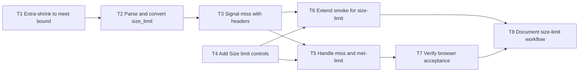

# Epic — image-size-limit

> **Spec:** [spec.md](../spec.md) · **Design:** [sad.md](../sad.md) · **Data model:** N/A (no schema) · **API:** [openapi.yaml](../contracts/openapi.yaml) · **ADRs:** [adr/](../adr/)

## Goal

Let the image owner apply an optional result byte budget on the existing one-form flow. Meet that budget when it is attainable, preferring the largest proportional result that still fits. Make an unattainable budget visible and retryable instead of a silent oversize file or a hard failure with no file.

Size S + route quick (from `.size` / `.route`). Artifact language English.

## Scope

- **In:** extra-shrink in `backend/images.py`, HTTP bound validation and miss headers in `backend/main.py`, SCR-01 Size limit controls and miss/met-limit completion, focused tests, smoke extension, browser acceptance and usage docs.
- **Out:** quality slider, silent format change, upload/decoded-pixel cap changes, batch/crop/stretch/enlarge, accounts, history, public deployment, a second screen, datastore/migrations, tracker export.

## Task map

Logical waves describe prerequisite readiness, not concurrent edit permission. `files_hint` overlap serializes T2/T3 (`backend/main.py`, `tests/test_images_api.py`) and T4/T5 (`frontend/src/App.tsx`). T1 and T4 start in parallel. T5 and T6 run in parallel after T3 and T4. No compile-coupled TypeScript/Go contract pair.

## Tasks

See [tracker.md](./tracker.md) for status. Machine contract: [tasks.json](../tasks.json). Every task includes its own concrete check; shared ACs describe complementary slices, not repeated whole-feature delivery.

| # | Task | Layer | Blocked by | DoD (short) |
|---|---|---|---|---|
| T1 | [Extra-shrink encoded output to meet a byte bound](./extra-shrink-to-meet-bound.md) | domain | — | tests/test_images.py extra-shrink and empty-bound geometry cases pass. |
| T2 | [Parse and convert optional size_limit fields](./parse-and-convert-size-limit.md) | ports | T1 | tests/test_images_api.py accept empty/size_limit-only and reject invalid bounds. |
| T3 | [Signal miss versus met-limit with response headers](./signal-miss-with-headers.md) | ports | T2 | tests/test_images_api.py assert omitted/met/miss headers on 200. |
| T4 | [Add Size limit number and unit radios](./add-size-limit-controls.md) | ui | — | SCR-01 default/ready/validation Size limit controls pass. |
| T5 | [Download on miss or met-limit without stale work](./handle-miss-and-met-limit.md) | ui | T3, T4 | SCR-01 loading/success/miss/error completion checks pass. |
| T6 | [Extend smoke coverage for the size-limit contract](./extend-smoke-for-size-limit.md) | tests | T3, T4 | tests/test_smoke.py covers size_limit-only JPEG, form copy and no lookup. |
| T7 | [Verify browser acceptance of Size limit and miss](./verify-browser-acceptance.md) | tests | T5 | _audit/browser-acceptance.md records 360/1280, keyboard, miss and owner contrast. |
| T8 | [Document the optional size-limit workflow](./document-size-limit-workflow.md) | docs | T6, T7 | README.md and docs/architecture-map.md match the shipped bound and miss path. |

## Risks / Hard rules

- HTTP validation stays in `backend/main.py`; extra-shrink stays in `backend/images.py`. Native encoding must not block the event loop.
- Size limit is not the 20,000,000-byte upload cap. Empty bound keeps today's geometry. No crop, stretch, enlarge or silent format change.
- A miss is HTTP 200 with a file, not a client-error rejection. Custom miss headers may be stripped by a future proxy; same-origin today, `blob.size` fallback is allowed.
- Extra-shrink search procedure is accepted debt: the implementer chooses the search as long as AC-05 holds.
- A tight bound can hold the only screen busy with no cancel. Keep a truthful busy state without fabricated percentages.

— `spec.md §6, NFR table, abridged` · [Full text](../spec.md); `sad.md §11, risks and accepted debt, abridged` · [Full text](../sad.md)
