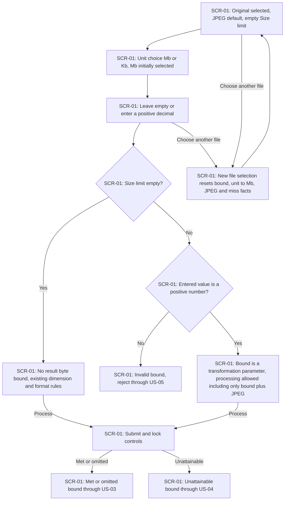
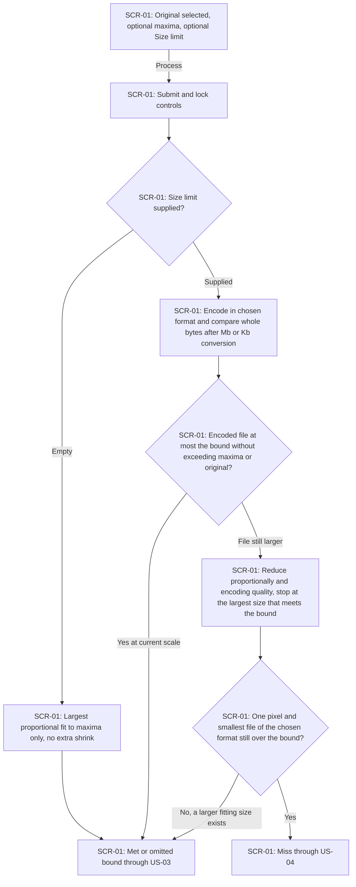
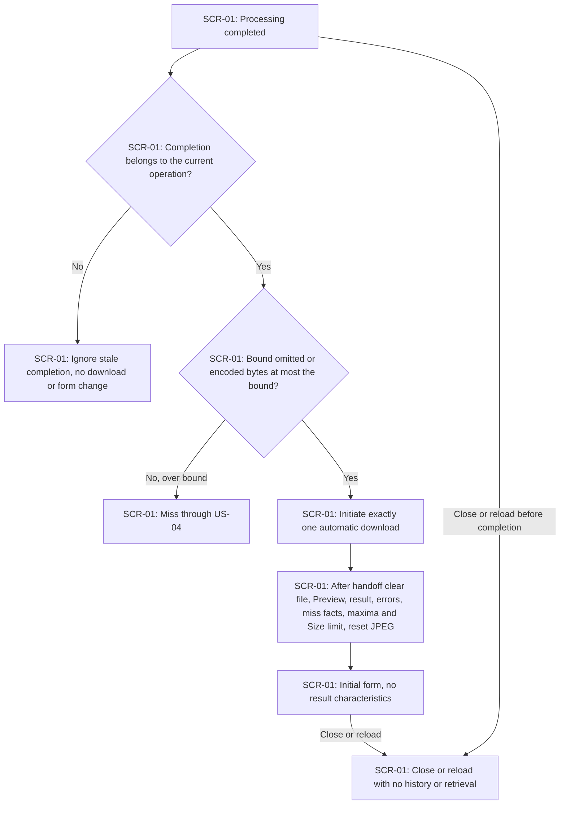
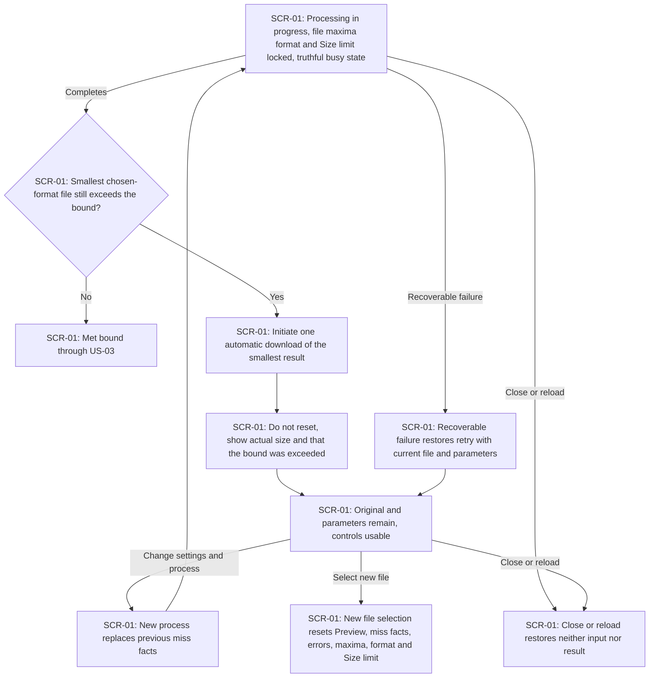
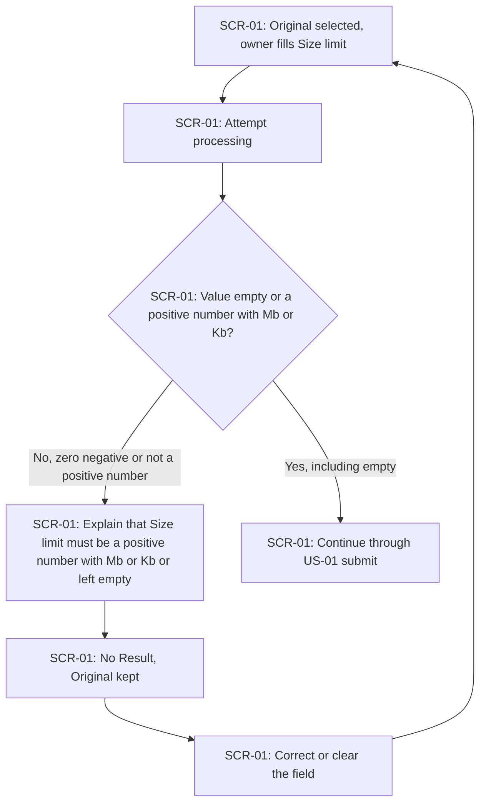

# UX flows — image-size-limit

> Source: [spec.md](./spec.md) and [CONTEXT.md](./CONTEXT.md). Route: quick. Depth: medium. The owner confirmed all five flows in prose. These flows feed design, sequences, screens and plan-tests.

## Platform decisions

- **Posture:** responsive-both — the owner confirmed equal support for phone and desktop, matching the spec's 360 and 1280 CSS-pixel checks. `docs/design-system.md` is absent; use code-mode assumptions and recommend `/sdd:design-system` at handoff.
- One page and one form, without a wizard, result page or confirmation dialog. Size limit extends the existing parameter fieldset. All user stories take place on SCR-01; busy, validation, miss and clean-form outcomes are not separate screens. Browser-managed file selection and download are external actions, not application screens.
- Unit choice is Mb or Kb with Mb selected initially; empty Size limit means no bound. Placement of the unit selector to the right of the number is a screens layout constraint, not a navigation branch.
- Processing locks file selection and all transformation controls including Size limit. The busy state is truthful, with no cancel action and no fabricated progress percentage.
- When the bound is met or omitted, success initiates one automatic download and resets the form after browser handoff: the selected file, Preview, Result, errors, miss facts, both dimension limits and Size limit are cleared and format returns to JPEG. When the bound cannot be met, one automatic download still starts, the form is kept, and the actual size plus that the bound was exceeded remain so the owner can retry. A new file selection starts a new cycle.
- The application offers no history, lookup or retrieval. Closing or reloading restores neither input nor result.
- Preserve keyboard access, visible focus, readable contrast and the complete journey at both viewport widths. Reduced motion removes decorative motion without losing functionality. Design must verify download handoff and resource cleanup without reset interrupting the download; these flows do not choose that implementation or any API contract.

## Screen inventory

| ID | Screen | Purpose | Entry | Exit |
|---|---|---|---|---|
| SCR-01 | Image processing | Select one original, set optional maxima, Size limit and format, submit, recover, miss-retry or receive an automatic download | Open or reload the application; return to the initial form after met-limit or omitted-limit download handoff | Browser download while remaining on SCR-01; select the next original; close the page |

## Flows

All five §4 user stories touch UI; no backend-only story is omitted. Cross-flow references below continue on SCR-01.

### Flow: US-01 — Set optional Size limit

The owner already has an original on SCR-01. The Size limit control offers Mb or Kb with Mb selected initially. Leaving the field empty applies no result byte bound, so dimension and format behaviour match the existing form. A zero, negative or otherwise non-positive value is rejected through US-05 and the original is kept. A positive decimal, including a bound supplied with only the initial JPEG and no maxima, counts as a transformation parameter and processing is allowed. Submit continues to US-03 when the bound is met or omitted, or to US-04 when it cannot be met. Choosing another file resets the bound, the unit to Mb, JPEG and miss facts.

### Flow: US-02 — Shrink below dimension ceiling

The owner submits on SCR-01. An empty Size limit keeps the existing geometry rule: the largest proportional scale that fits all supplied maxima, with no extra reduction. An oriented original of 2400 by 1200 pixels with only maximum width 1200 yields 1200 by 600. A supplied bound is converted to whole bytes (the entered number times 1,000,000 for Mb or 1,000 for Kb; 0.5 Mb equals 500,000 bytes) and compared with the encoded result. The result never exceeds any supplied dimension bound or either original oriented dimension, never enlarges, never crops or stretches, and keeps the chosen output format. Additional reduction happens only while the encoded file is larger than the bound and stops at the largest proportional size and highest encoding quality that already meets it. If even one pixel and the smallest file of that format still exceed the bound, that is a miss under US-04, not a rejection without a file. Otherwise success continues through US-03. For 2400 by 1200 with maximum width 1200 and a bound smaller than the 1200-by-600 encoding, the result is shorter than 1200 in width, with aspect ratio 2 to 1 subject to nearest-pixel rounding, halves up, minimum one pixel.

### Flow: US-03 — Download when within limit

Only a completion that belongs to the current operation may change the page. A stale completion has no download and does not change the form. When Size limit is empty or the encoded result is at most the bound, the page initiates exactly one automatic download, then resets to the initial empty state: the selected file, Preview, Result, errors, miss facts, both dimension limits and Size limit are cleared and format returns to JPEG. No result characteristics remain. Closing or reloading restores nothing; the application provides no history, lookup or retrieval of a result from this or another operation. An over-bound completion continues through US-04.

### Flow: US-04 — Retry after a miss

While processing, file selection and all transformation controls including Size limit are disabled and a truthful busy state is shown, without fabricated percentages or a cancel action. Only the current operation may initiate a download. If the bound is met, success follows US-03. If even the smallest chosen-format file still exceeds the bound, that file is still produced and one automatic download starts; the form is not reset; the page shows the actual Result size and that the Size limit was exceeded. The original and parameters remain and the controls are usable again so the owner can change settings and process again. A new process replaces previous miss facts. A recoverable failure restores retry with the selected file and parameters. A new file selection resets Preview, miss facts, errors, maxima, format and Size limit. Closing or reloading restores neither input nor result.

### Flow: US-05 — Correct an invalid Size limit

When processing is attempted with a filled Size limit that is zero, negative or not a positive number, the system rejects the attempt and explains that Size limit must be a positive number with Mb or Kb or left empty. No Result is produced and the Original is kept so the owner can correct or clear the field without choosing a new file. Empty remains valid and means no bound; that path continues through US-01.

## AC coverage

| AC | Shown by | Notes |
|---|---|---|
| AC-01 | US-01: S1_EMPTY, S1_NOBOUND | Empty bound applies no result byte bound; dimension and format behaviour match the existing form. |
| AC-02 | US-01: S1_UNIT, S1_EDIT | Positive decimal; Mb or Kb; Mb initially selected; empty allowed. Left-of-number placement is a screens layout constraint. |
| AC-03 | US-01: S1_ALLOWED | A supplied bound with only the initial JPEG is enough to process. |
| AC-04 | US-02: S2_BOUND empty, S2_GEOMETRY | 2400 by 1200 with max width 1200 yields 1200 by 600; no extra shrink. |
| AC-05 | US-02: S2_ENCODE, S2_MEETS, S2_REDUCE, S2_FLOOR, S2_MISS | Extra shrink only while over bound; one-pixel miss continues through US-04, not a no-file rejection. |
| AC-06 | US-03: S3_DOWNLOAD, S3_RESET, S3_CLEAN | One automatic download then full clean form, including Size limit and miss facts. |
| AC-07 | US-04: S4_DOWNLOAD, S4_KEEP, S4_RETRY | Smallest file still downloads; form kept; actual size and exceeded notice. |
| AC-08 | US-05: S5_ERROR, S5_KEEP | Invalid bound rejected; no result; original remains. |
| AC-09 | US-03: S3_REOPEN; US-04: S4_REOPEN | N/A as a navigable flow: no history, lookup or retrieve screen exists. Retrieval attempts are boundary tests, not navigation. |
| AC-10 | US-01: S1_RESET; US-04: S4_NEWFILE | New file selection resets Preview, miss facts, errors, maxima, format and Size limit. Stale work must not restore an old Preview, miss or download. |
| AC-11 | US-04: S4_WAIT, S4_REPLACE, S4_FAIL, S4_RETRY, S4_REOPEN | Lock including Size limit; truthful busy; new process replaces miss facts; current-only download; retry after miss stays usable; close/reload restores nothing. |
| AC-12 | US-01: S1_UNIT; US-02: S2_ENCODE | 1 Mb = 1,000,000 bytes; 1 Kb = 1,000 bytes; 0.5 Mb = 500,000 bytes. Comparison uses encoded whole bytes, not a screen. |
