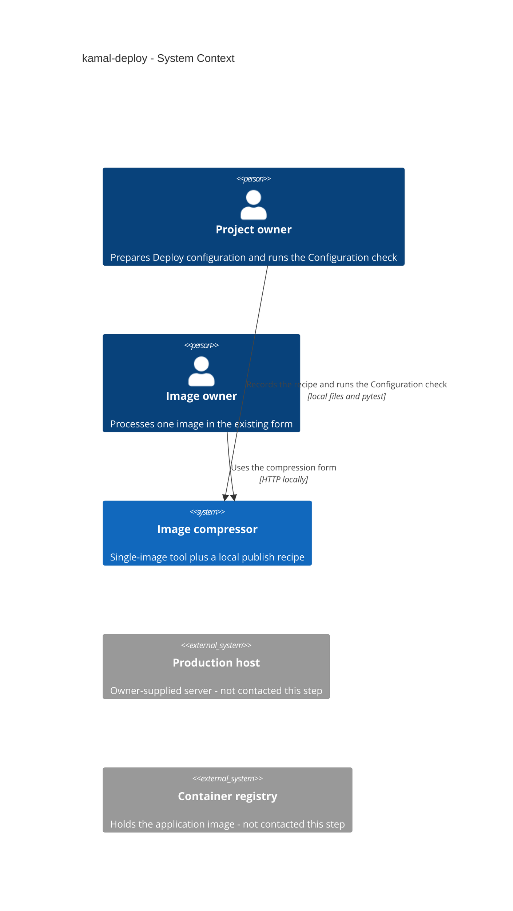
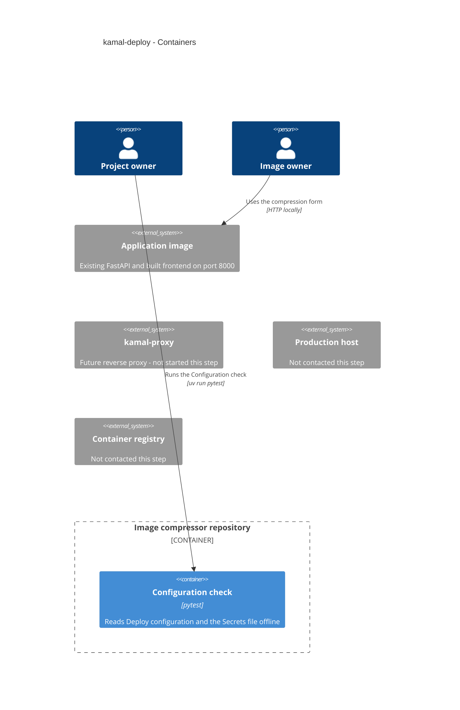
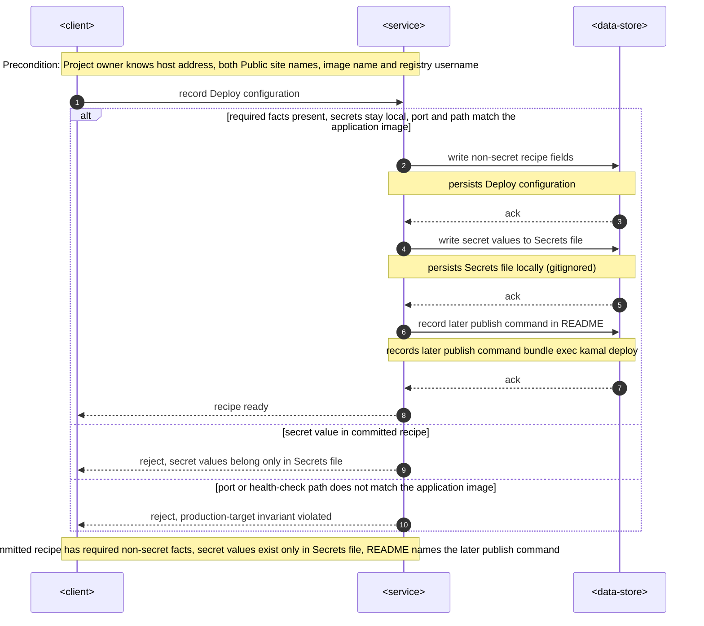
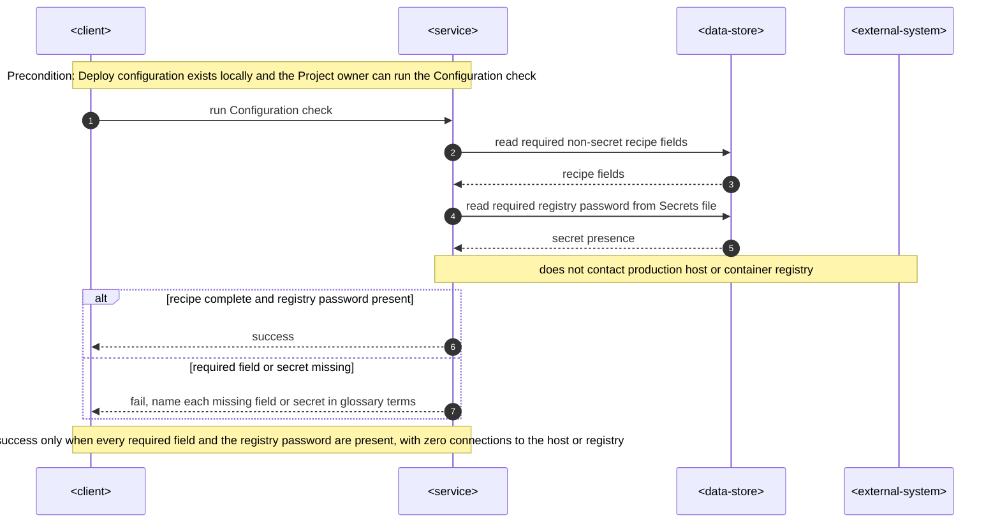
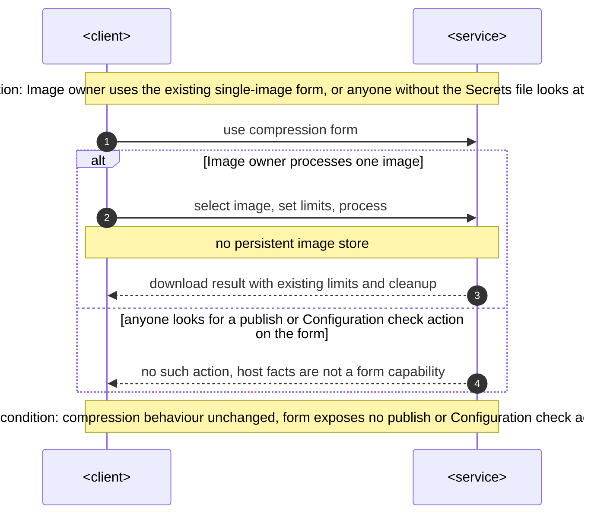

# Software Architecture Document — kamal-deploy

The owner approved depth easy, size S and route quick. Documents remain English, matching this feature folder. Canonical domain terms are in [CONTEXT.md](./CONTEXT.md). This document records architecture only; it does not run a live publish.

**Design review — 2026-09-13.** All twelve sections were written through the easy-depth design walk. An independent clean-context critic reviewed the written SAD and two ADRs and returned `NO_CONTESTED_DECISIONS`. All three Mermaid blocks rendered with `mmdc`. Structural checks confirmed the section count, declared `cli` surface, Accepted ADRs, closed ADR index and absence of template placeholders. All spec §6 NFR targets match verbatim.

## 1. Introduction and goals

**Intent.** Give the Project owner a complete committed Deploy configuration — the Kamal publish recipe with the known non-secret host facts — and a local Configuration check that proves that recipe is readable and complete without contacting the production host or the container registry. Secret values stay in the local Secrets file. Live publish, host provisioning, DNS and certificates stay later. The Image owner's compression form does not change.

**Top-3 quality goals (1-liners; full scenarios in §10):**

1. Secret leakage: 0 secret values in committed files; environment-variable names are allowed.
2. Host and registry contact during check: 0 connections to the production host and 0 connections to the container registry.
3. Configuration check runtime ≤ 30 s on the Project owner's machine, and recipe completeness 100% of required non-secret fields and the required registry password present or the check is not successful.

**Stakeholders.**

| Role | Interest | Sign-off owner? |
|---|---|---|
| Project owner | Complete recipe, local secrets, Configuration check, later publish command | Yes |
| Image owner | Unchanged selection, limits, download and cleanup; no publish action on the form | No |
| Tech Lead | SAD approval | Yes |

## 2. Constraints

**Technical.**
- Application runtime remains Python 3.14.6, FastAPI and Uvicorn on port 8000, health at `GET /api/health`. The existing multi-stage Dockerfile already produces one non-root application image (UID 10001).
- Deployment tooling is Kamal 2.12.0 via `bundle exec kamal`, with Ruby 4.0.5 pinned by mise. Do not add `gem:kamal` to `mise.toml`.
- No datastore, queue, accessory or second environment. Foundation [ADR 0002](../../adr/0002-single-service-and-kamal.md) already fixes `proxy.app_port: 8000` and `proxy.healthcheck.path: /api/health`.
- Interview facts, committed as non-secret recipe values: host `138.201.118.229`, Public site names `image.bondev.eu` and `www.image.bondev.eu`, image `shved270189/image_compressor`, registry username `shved270189`, HTTPS on, service name exactly `image_compressor`, image architecture amd64.

**Organisational.**
- Size S, route quick. No launch deadline for going live. This step is configuration-only; the Project owner runs the later publish.
- No new CI job. The existing pytest suite may cover the Configuration check with a throwaway secrets fixture that is not production secrets.
- The Project owner holds secrets locally and will run `bundle exec kamal deploy` later.

**Conventions.**
- Follow [AGENTS.md](../../../AGENTS.md), the [architecture map](../../architecture-map.md) and foundation [ADR 0001](../../adr/0001-stack-and-development-tools.md) / [ADR 0002](../../adr/0002-single-service-and-kamal.md).
- HTTP validation stays in `backend/main.py`; this feature does not add image functions or frontend behaviour.
- Run Kamal only as `bundle exec kamal`. Use root mise tasks and the existing uv, npm and Bundler lockfiles.

**Regulatory / external.**
- Spec §6.1: no new personal data, no new application account boundary, security review N/A.
- Host address, Public site names, image name, service name and image architecture are internal and become public in git (accepted residual). Registry password and SSH private key are confidential.
- Pre-launch targeting of the committed host address before live hardening is an accepted residual; this step does not harden the host.

## 3. Context and scope

The Project owner already has a working local form and an application image. This increment records the publish recipe in the repository and proves it locally. The Image owner continues to process one image per operation on that form. The production host and the container registry exist as later destinations; this step must not contact them.

<!-- brownfield: architecture-map.md reflects_commit 3236057, HEAD f817bdb is that survey; config/deploy.yml and .kamal/ absent; Kamal 2.12.0 locked; application image listens on 8000 with /api/health -->

**External systems (in / out):**

| Actor or system | Type | Interaction |
|---|---|---|
| Project owner | Person | Records Deploy configuration, holds the Secrets file, runs the Configuration check |
| Image owner | Person | Uses the existing compression form; no publish or check action |
| Image compressor | System (this product) | Existing application image plus the new local recipe and check |
| Production host | System (external) | Owner-supplied server `138.201.118.229` — not contacted this step |
| Container registry | System (external) | Holds `shved270189/image_compressor` — not contacted this step |

**Trust boundary.** Secret values never leave the Project owner's machine into git. Committed recipe fields are public. The Configuration check reads local files only; it does not authenticate to the host or the registry. The compression form is not a control plane for publish.

**C4 Context (L1):**



Context in prose: Project owner and Image owner both talk to Image compressor. The host and registry are drawn so the trust zone is visible, with no relationship this step.

## 4. Solution strategy

**Top strategic choices (the seeds for ADRs):**

1. **Declare a CLI surface for the Configuration check.** `target_surfaces: [cli]`. The Project owner runs a local command. The Image owner form and the FastAPI application are unchanged, so this feature does not add `web-frontend` or `backend-service`. Downstream stages read that declaration: the contract is a command with exit codes, not OpenAPI, and there is no UI task layer. [ADR 0001](./adr/0001-declare-cli-surface-for-configuration-check.md) records the surface.

2. **Commit real non-secret host facts in `config/deploy.yml`; keep secret values only in the gitignored Secrets file.** The recipe may contain environment-variable names, including the registry-password name. Values live in `.kamal/secrets`. SSH private key is not required in that file. No second destination file, accessory or extra service.

3. **Prove the recipe with an offline pytest Configuration check.** The check is a test in the existing suite. It reads Deploy configuration and a throwaway Secrets file fixture, names missing required fields in glossary terms, and does not invoke Kamal commands that can open sockets to the host or the registry. The Project owner runs it with `uv run pytest`. No new CI job and no extra mise task. [ADR 0002](./adr/0002-prove-recipe-with-offline-pytest-check.md) records this over Kamal-native config dump and a separate mise wrapper.

4. **Reuse the existing one-application-service production target.** The recipe points kamal-proxy at port 8000 and health path `/api/health`, sets service name `image_compressor`, enables HTTPS for both Public site names, and builds amd64. This inherits foundation ADR 0002; it does not add a second container or change processing limits.

Each tactical decision in later sections should trace to one of these seeds. Tactical decisions that contradict a strategic choice are red flags — surface them in §11.

## 5. Building block view

This feature adds repository-root configuration and a verification test. It does not introduce a new application module, datastore or HTTP handler. The layering is file-plus-check: Kamal 2 reads `config/deploy.yml` at later publish time; this step only writes that file and proves it offline.

**Internal decomposition:**

```
repository root
├── config/deploy.yml              Deploy configuration (Kamal 2 recipe, committed)
├── .kamal/secrets                 Secrets file (gitignored; throwaway fixture in tests)
├── tests/test_kamal_deploy.py     Configuration check (offline pytest)
├── .gitignore                     Ignore the Secrets file
└── README.md                      Later publish command: bundle exec kamal deploy
```

The existing `backend/` and `frontend/` trees are out of scope. `.gitignore` does not yet ignore `.kamal/secrets`; implementation must add that ignore.

**C4 Container (L2):**



Containers in prose: the only container this feature owns is the Configuration check (the `cli` surface). Deploy configuration and the Secrets file are its inputs, not extra C4 containers. The Application image and kamal-proxy already exist as the later production topology; this step does not start them or talk to the host or registry.

## 6. Runtime view

Size S: three command-level flows with collapsed internal steps. Participants stay generic. Local Deploy configuration and the Secrets file are the data-store stand-in (files, not a database). The production host and the container registry appear only as an external system that the Configuration check must not contact.

### Record deploy configuration

Covers US-01, US-02, US-05 and AC-01, AC-02, AC-05, AC-08.



### Run configuration check

Covers US-03, US-04 and AC-03, AC-04.



### Cross-cutting: form has no publish action

Covers US-06 and AC-06, AC-07.



**Use-case coverage**

| User story | Flow |
|---|---|
| US-01 Record deploy configuration | Record deploy configuration |
| US-02 Keep secrets local | Record deploy configuration |
| US-03 Run configuration check | Run configuration check |
| US-04 See a missing-field failure | Run configuration check (missing-field branch) |
| US-05 Read the later publish command | Record deploy configuration |
| US-06 Leave the compression form unchanged | Cross-cutting: form has no publish action |

**AC coverage**

| AC | Where shown |
|---|---|
| AC-01 | Record deploy configuration — happy path |
| AC-02 | Record deploy configuration — secrets written to Secrets file; `else` secret value in committed recipe |
| AC-03 | Run configuration check — happy path |
| AC-04 | Run configuration check — `else` required field or secret missing |
| AC-05 | Record deploy configuration — README later publish command |
| AC-06 | Cross-cutting: form has no publish action — `else` no publish or Configuration check action |
| AC-07 | Cross-cutting: form has no publish action — process one image, no persistent image store |
| AC-08 | Record deploy configuration — happy-path guard and `else` port or health-check path mismatch |

**Flags (not ADRs)**

- Run configuration check uses `<external-system>` for the production host and container registry. Those are §3 context systems, not an internal §5 container. Drawn only to show isolation (zero connections).
- Cross-cutting form flow uses the existing application image as `<service>`. That is not a new §5 building block.
- `<data-store>` is local files (Deploy configuration and the Secrets file), not a database. No entity, column or index appears in any persist note.
- All three flows are sync. No idempotency-key, retry or dead-letter.

## 7. Deployment view

This step does not apply the topology. The recipe describes one production host (`138.201.118.229`) running kamal-proxy on ports 80 and 443, forwarding HTTPS for `image.bondev.eu` and `www.image.bondev.eu` to one application container on port 8000. Service name is `image_compressor`. The image is `shved270189/image_compressor` for amd64. Replicas: one. No accessories.

**Monitoring:**
- This step: Configuration check outcome (success or named gaps). No live uptime metrics.
- Later publish (out of scope): kamal-proxy health against `/api/health` on port 8000.

**Scaling thresholds:**
- Single host, single application container. No partition or replica threshold in this increment.
- Image architecture is amd64 even when the Project owner's machine is arm64; first live publish may need a cross-architecture builder. That is a later-publish risk, not a check failure.

## 8. Crosscutting concepts

| Concept | Convention | Where defined |
|---|---|---|
| Logging | No new application logs. Configuration check reports success or named gaps on stdout via pytest | This section |
| Authentication | No new application accounts. Only a Project owner with the Secrets file can run the check and the later publish | spec.md §6.1 |
| Authorization | The compression form exposes no publish or Configuration check action | spec.md AC-06 |
| Error handling | Missing required recipe field or secret fails the check and names each gap in glossary terms | spec.md AC-04 |
| Secrets | Secret values only in `.kamal/secrets`, which git ignores; recipe may contain environment-variable names | spec.md AC-02, this section |
| ID strategy | N/A — no entities or persistent records | — |
| Internationalisation | N/A, single language | — |
| Observability | No new traces or metrics. Check runtime is wall clock of the documented check command | spec.md §6 |
| Events | N/A — no async work | — |
| Persistence | Unchanged: request-scoped uploads, no image store | foundation ADR 0003 |

## 9. Architecture decisions

| # | Title | Status | Section |
|---|---|---|---|
| 0001 | Declare a CLI surface for the Configuration check | Accepted | §4 |
| 0002 | Prove the recipe with an offline pytest Configuration check | Accepted | §4 |

ADR files live under `docs/features/kamal-deploy/adr/`. Foundation [ADR 0001](../../adr/0001-stack-and-development-tools.md) and [ADR 0002](../../adr/0002-single-service-and-kamal.md) remain authoritative for the Kamal gem, one application service, port 8000 and `/api/health`.

## 10. Quality requirements

Each top-3 goal from §1 expanded into a full scenario. Numbers are from spec.md §6 NFR verbatim.

**QG-1. Secret leakage**
- **When:** anyone inspects the committed repository after Deploy configuration is recorded
- **Then:** 0 secret values in committed files; environment-variable names are allowed; registry password and SSH private key material are absent; secret values exist only in the Project owner's Secrets file, which git ignores
- **How verify:** integration test that the Secrets file is gitignored, that committed tree contains no password values or private-key material, and that a throwaway secrets fixture used by the Configuration check is not production secrets (spec §7 KPI: Secret leakage target 0)

**QG-2. Host and registry isolation during check**
- **When:** the Project owner runs the Configuration check with a complete recipe and the required registry password present
- **Then:** 0 connections to the production host and 0 connections to the container registry; the check reports success
- **How verify:** integration test of the Configuration check that does not open a session or TCP to `138.201.118.229` or the registry (pytest reads local files only; it does not invoke Kamal network commands)

**QG-3. Check runtime and recipe completeness**
- **When:** the Project owner runs the Configuration check on their machine
- **Then:** wall clock of the documented check command is ≤ 30 s; the check is successful only when 100% of required non-secret fields and the required registry password are present; otherwise it fails and names each missing required field or secret in glossary terms
- **How verify:** existing pytest suite duration (KPI: 1 passing run with throwaway secrets fixture, 1 failing run when the Secrets file is absent); AC-04 names gaps rather than reporting success

Application form latency, throughput and public uptime remain N/A: this step does not publish the site.

## 11. Risks and technical debt

| Risk / debt | Severity | Mitigation | Owner |
|---|---|---|---|
| Which SSH user will the later publish use on `138.201.118.229`? Default now: not required for the Configuration check | Open question | Resolve before first live publish; the check does not require an SSH user | Project owner |
| Do both Public site names already point at that host, and will certificates be issued only at publish time? Default now: not verified in this step | Open question | Resolve before first live publish; DNS and certificates are non-goals here | Project owner |
| A green Configuration check treated as proof that DNS, certificates or image pull will work | Medium | Check must not claim live readiness; spec accepts that first live publish may still fail | Project owner |
| Committed host address can be targeted before live hardening | Low | Accepted residual; this step does not harden the host | Project owner |
| Secrets present on the machine that wrote the recipe but absent on the machine that later publishes | Medium | Later command fails loudly; this step does not copy secrets. SSH private key is not required in the Secrets file | Project owner |
| Recipe builds amd64 while a local Docker check previously ran on arm64 | Medium | Record `builder.arch: amd64` in Deploy configuration; first live publish may need a cross-architecture builder | Project owner |
| `.gitignore` does not yet ignore `.kamal/secrets` | Low | Implementation adds the ignore before any real Secrets file is created | Tech Lead |

**Accepted debt (acceptable in v1, plan to fix later):**
- No live publish, `kamal setup`, host purchase, DNS, certificates, or CI auto-publish in this increment.
- Configuration check does not parse the recipe through Kamal itself, so a Kamal-specific YAML quirk can pass the check and fail later deploy.
- SSH user remains unset until first live publish.

## 12. Glossary

| Term | Meaning |
|---|---|
| Configuration check | A local command that proves Deploy configuration is readable and complete without contacting the production host or the container registry. NOT a live publish. |
| Deploy configuration | The committed publish recipe the Project owner prepares so a later live command can run: host address, Public site names, image name, registry username, service name `image_compressor`, image architecture amd64, listening port, health-check path, and HTTPS. NOT the live running site and NOT secret values. |
| Image owner | The person processing their selected image in the form. NOT Project owner (the person preparing Deploy configuration). |
| Project owner | The person who prepares Deploy configuration, holds secrets locally, runs the Configuration check, and will run the live publish later. NOT Image owner. |
| Public site name | A hostname the Project owner intends visitors to open after a later publish (`image.bondev.eu` and `www.image.bondev.eu`). NOT a local development URL. |
| Secrets file | The Project owner's local gitignored file `.kamal/secrets` that holds secret values such as the registry password. NOT committed Deploy configuration (which may contain only environment-variable names) and NOT an SSH private key that may stay in the machine's default agent. |
| Later publish command | Exactly `bundle exec kamal deploy`. This step documents it and does not run it. |
