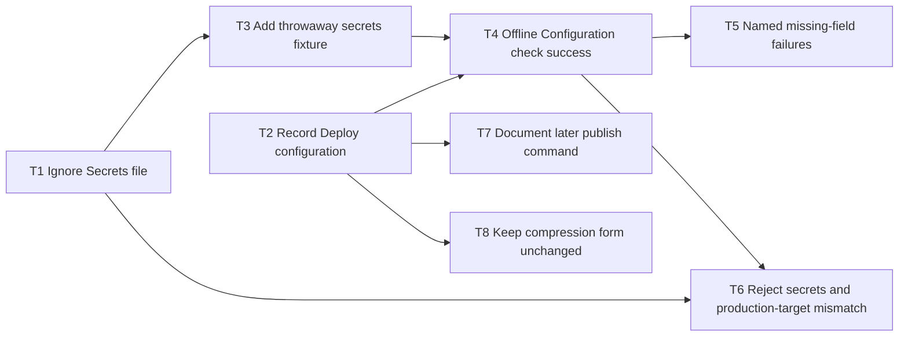

# Epic — kamal-deploy

> **Spec:** [spec.md](../spec.md) · **Design:** [sad.md](../sad.md) · **Data model:** N/A (no schema) · **API:** [cli.md](../contracts/cli.md) · **ADRs:** [adr/](../adr/)

## Goal

Give the Project owner a complete committed Deploy configuration with the known non-secret host facts, and a local Configuration check that proves that recipe is readable without contacting the production host or the container registry. Secret values stay in the gitignored Secrets file. Live publish stays later; the Image owner's compression form does not change.

Size S + route quick (from `.size` / `.route`). Artifact language English. Target surface `cli` — no `ui` layer.

## Scope

- **In:** `config/deploy.yml`, `.gitignore` for `.kamal/secrets`, throwaway secrets fixture, offline pytest Configuration check, README later publish command, form/smoke regression.
- **Out:** live publish, `kamal setup`, host purchase, DNS, certificates, a new CI job, a mise wrapper, a second environment or accessory, form or processing changes, datastore/migrations, tracker export.

## Task map

Logical waves describe prerequisite readiness, not concurrent edit permission. `files_hint` overlap serializes T4/T5/T6 (`tests/test_kamal_deploy.py`). T1 and T2 start in parallel. T3, T7 and T8 run in parallel after their deps. No compile-coupled TypeScript/Go contract pair.

## Tasks

See [tracker.md](./tracker.md) for status. Machine contract: [tasks.json](../tasks.json).

| # | Task | Layer | Blocked by | DoD (short) |
|---|---|---|---|---|
| T1 | [Ignore the Secrets file in git](./ignore-the-secrets-file.md) | infra | — | `git check-ignore -q .kamal/secrets` exits 0. |
| T2 | [Record Deploy configuration with locked host facts](./record-deploy-configuration.md) | infra | — | `config/deploy.yml` has the locked host, sites, image, registry, HTTPS, service, arch, port and health path. |
| T3 | [Add a throwaway Secrets file fixture](./add-throwaway-secrets-fixture.md) | tests | T1 | `tests/fixtures/kamal/secrets` holds `KAMAL_REGISTRY_PASSWORD=test-registry-password`. |
| T4 | [Implement the offline Configuration check success path](./implement-offline-configuration-check.md) | ports | T2, T3 | `uv run pytest tests/test_kamal_deploy.py::test_configuration_check_succeeds_offline` passes without Kamal or network. |
| T5 | [Fail the Configuration check with named missing fields and secrets](./fail-check-with-named-gaps.md) | tests | T4 | missing-field and missing-secret cases name each gap in glossary terms and do not report success. |
| T6 | [Reject committed secrets and production-target mismatch](./reject-committed-secrets-and-production-target.md) | tests | T1, T4 | gitignore, no secret values in git, port 8000 and `/api/health` asserted; mismatch is not success. |
| T7 | [Document the later publish command](./document-later-publish-command.md) | docs | T2 | README contains exactly `bundle exec kamal deploy`; this step does not run it. |
| T8 | [Keep the compression form and existing smoke unchanged](./keep-compression-form-unchanged.md) | tests | T2 | `tests/test_smoke.py` still passes and asserts the form has no publish action. |

## Risks / Hard rules

- 0 secret values in committed files; environment-variable names are allowed. Ignore `.kamal/secrets` before any real Secrets file exists.
- 0 connections to the production host or the container registry during the check. Do not invoke `bundle exec kamal config`, `deploy`, `setup`, or registry login.
- Configuration check runtime ≤ 30 s. A green check does not prove DNS, certificates, or image pull.
- No new CI job, no extra mise task, no `gem:kamal` in `mise.toml`. Run Kamal only as `bundle exec kamal`.
- Do not change `backend/` or `frontend/`. Production target remains port 8000 and `/api/health`.
- SSH user, DNS and certificates stay open until first live publish.

— `spec.md §6, NFR table, abridged` · [Full text](../spec.md); `sad.md §11, risks and accepted debt, abridged` · [Full text](../sad.md)
